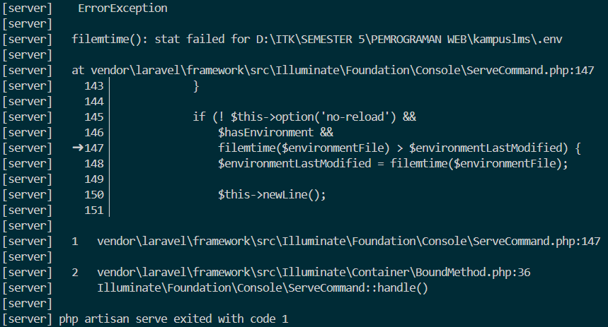
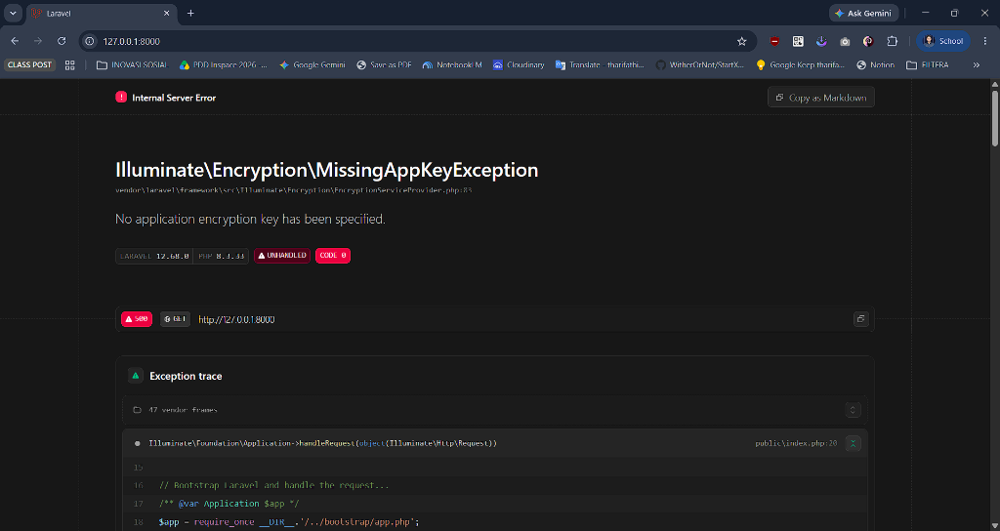
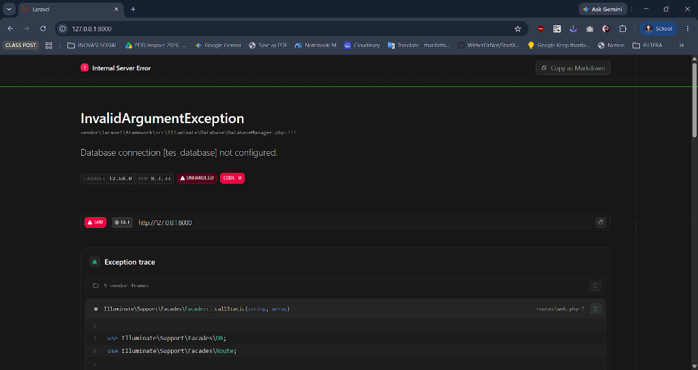

# Catatan Praktikum Minggu 1

**Mata Kuliah:** Pemrograman Web 
**Nama:** Muhammad Rifa Al Rizqul Aulia
**NIM:** 10241050

---

## READ: Bedah Instalasi Laravel 12

### Analisis Berkas `public/index.php`
1. Berkas `public/index.php` berfungsi sebagai satu-satunya pintu masuk utama bagi seluruh HTTP request yang diarahkan oleh web server menuju aplikasi Laravel.
2. Di dalamnya dilakukan pengecekan status pemeliharaan serta registrasi autoloader Composer (`vendor/autoload.php`) agar seluruh dependensi dan class dapat dimuat secara otomatis.
3. Berkas ini menginisialisasi instance aplikasi melalui `bootstrap/app.php` dan mengeksekusi method `handleRequest()` dengan menangkap request pengguna (`Request::capture()`) untuk menghasilkan HTTP response kembali ke browser.

---

### Analisis Berkas `bootstrap/app.php`
Di Laravel 12, `bootstrap/app.php` merupakan pusat konfigurasi utama yang menggantikan peran `Kernel.php` pada versi Laravel sebelumnya.
* **Routing (`->withRouting(...)`):** Mendaftarkan lokasi berkas routing web (`routes/web.php`), console command (`routes/console.php`), dan rute pemantau status kesehatan aplikasi (`health: '/up'`).
* **Middleware (`->withMiddleware(...)`):** Titik konfigurasi untuk mendaftarkan middleware global, grup middleware, atau alias middleware.
* **Exceptions (`->withExceptions(...)`):** Titik penanganan exception dan kustomisasi pelaporan error aplikasi.

---

### Analisis `routes/web.php`
* **Route Default Awal:**
  Route awal yang menghasilkan halaman selamat datang bawaan Laravel:
  ```php
  Route::get('/', function () {
      return view('welcome');
  });
  ```
  **Tampilan Awal di Browser:**
  

* **Uji Perubahan Response Route:**
  Mencoba mengubah response route langsung menjadi string teks:
  ```php
  Route::get('/', function () {
      return 'HALO NAMA KU RIFA';
  });
  ```
  **Tampilan Setelah Diubah & Di-refresh:**
  

* **Kesimpulan Uji Perubahan:**
  Ketika kode di dalam `routes/web.php` diubah, browser langsung memuat respon baru secara instan saat halaman di-*refresh*. Hal ini membuktikan bahwa alur request dari browser ke URL `/` sepenuhnya dikontrol dan ditangani oleh rute tersebut.

---

### Hasil Perintah `php artisan route:list`

Keluaran terminal saat menjalankan perintah `php artisan route:list`:

```text
  GET|HEAD  / ....................................................................................... routes/web.php:5
  GET|HEAD  storage/{path} storage.local › vendor/laravel/framework/src/Illuminate/Filesystem/FilesystemServiceProvider...
  PUT       storage/{path} storage.local.upload › vendor/laravel/framework/src/Illuminate/Filesystem/FilesystemService...
  GET|HEAD  up ........... vendor/laravel/framework/src/Illuminate/Foundation/Configuration/ApplicationBuilder.php:219

                                                                                                    Showing [4] routes
```

**Pencocokan dengan berkas proyek:**
* **`GET|HEAD /`** $\rightarrow$ Didefinisikan secara manual pada berkas `routes/web.php` baris ke-5 yang mengarahkan request root ke view `welcome`.
* **`GET|HEAD up`** $\rightarrow$ Rute health check otomatis yang didaftarkan pada berkas `bootstrap/app.php` (`health: '/up'`).
* **`GET|HEAD storage/{path}` & `PUT storage/{path}`** $\rightarrow$ Rute bawaan framework (`FilesystemServiceProvider`) untuk mengelola akses berkas storage lokal.

---

## BREAK: Eksperimen Penanganan Error

| # | Skenario yang Dirusak | Prediksi Anda sebelum mencoba | Pesan Error Sebenarnya | Catatan & Analisis |
|---|-----------------------|-------------------------------|------------------------|-------------------|
| 1 | Ganti nama `.env` menjadi `.env.bak` | Server mendeteksi hilangnya berkas konfigurasi lokal dan server otomatis terhenti atau error. |  | `php artisan serve` secara aktif memantau perubahan waktu modifikasi (`filemtime`) berkas `.env` untuk fitur *auto-reload*. Saat nama berkas diubah menjadi `.env.bak`, proses *watcher* gagal menemukan berkas dan server otomatis *crash* (`php artisan serve exited with code 1`). |
| 2 | Kosongkan nilai `APP_KEY` di `.env` | Aplikasi menolak memproses enkripsi session/cookie dan memunculkan exception fatal. |  | `Illuminate\Encryption\MissingAppKeyException: No application encryption key has been specified.`<br>`APP_KEY` dibutuhkan oleh modul enkripsi Laravel untuk mengamankan data session, cookie, dan payload. Tanpa key, framework menolak memproses request demi keamanan. |
| 3 | Ubah `DB_DATABASE` / `DB_CONNECTION` ke nama yang tidak ada | Koneksi ke database gagal saat query/migrasi dijalankan dan menampilkan pesan exception. | **Di Terminal (`php artisan migrate:status`):**<br><br><br>**Di Browser (`APP_DEBUG=true`):**<br> | `InvalidArgumentException: Database connection [tes_database] not configured.`<br>Konfigurasi koneksi tidak ditemukan di `config/database.php`. Pada mode debug aktif (`APP_DEBUG=true`), Laravel menampilkan layar merah *Ignition* lengkap dengan jejak eksekusi kode. |
| 4 | Ubah `APP_DEBUG=false`, lalu ulangi nomor 3 | Halaman web hanya menampilkan pesan error umum 500 tanpa memperlihatkan detail kode. |  | **Tampilan Browser:** `500 \| SERVER ERROR`<br>Saat mode debug dinonaktifkan (`APP_DEBUG=false`), Laravel menyembunyikan seluruh pesan error mentah dan *stack trace*, lalu menggantinya dengan halaman HTTP 500 generik untuk mencegah kebocoran informasi sensitif di lingkungan produksi. |

> **Catatan Pengujian 3 & 4:** Karena halaman bawaan `welcome` tidak memanggil database (*lazy database connection*), `routes/web.php` diubah sementara dari `return view('welcome')` menjadi `return DB::select('SELECT 1')` untuk memicu koneksi database di browser dan mengamati langsung perbedaan respon `APP_DEBUG=true` (layar debug) dengan `APP_DEBUG=false` (layar 500).

---

## FIX: Perbaikan Proyek Cacat (Branch `w01`)

*(Bagian ini ditunda sementara menunggu rilis tautan repositori `kampuslms-broken` dan instruksi dari Dosen / Asisten Dosen saat sesi praktikum)*

---

## Checkpoint Refleksi Pemahaman

1. Browser $\rightarrow$ Web Server $\rightarrow$ `public/index.php` $\rightarrow$ `bootstrap/app.php` $\rightarrow$ Middleware $\rightarrow$ Routing (`routes/web.php`) $\rightarrow$ Controller/Closure $\rightarrow$ Model (Database) $\rightarrow$ View (Blade) $\rightarrow$ HTTP Response $\rightarrow$ Browser.
2. Hanya folder `public/` yang boleh diekspos ke publik agar berkas sensitif seperti `.env`, logika kode di `app/`, migrasi di `database/`, dan log di `storage/` tidak dapat diunduh langsung oleh siapa pun melalui browser.
3. `.env` memuat nilai rahasia aktual (kredensial database, API keys) dan bersifat lokal sehingga tidak boleh di-push ke Git. `.env.example` hanyalah cetak biru template variabel tanpa nilai rahasia yang wajib di-push ke repositori.
4. Laravel 11 dan 12 menyederhanakan struktur folder dengan menghapus `app/Http/Kernel.php` dan memindahkan registrasi middleware ke `bootstrap/app.php`.
5. Jika terjadi error, Laravel akan menampilkan halaman debug interaktif lengkap dengan isi variabel lingkungan, query database, password DB, dan struktur direktori server kepada pengunjung.
6. Bukti commit kontribusi individu dapat dilihat melalui riwayat `git log` pada repositori kelompok.
