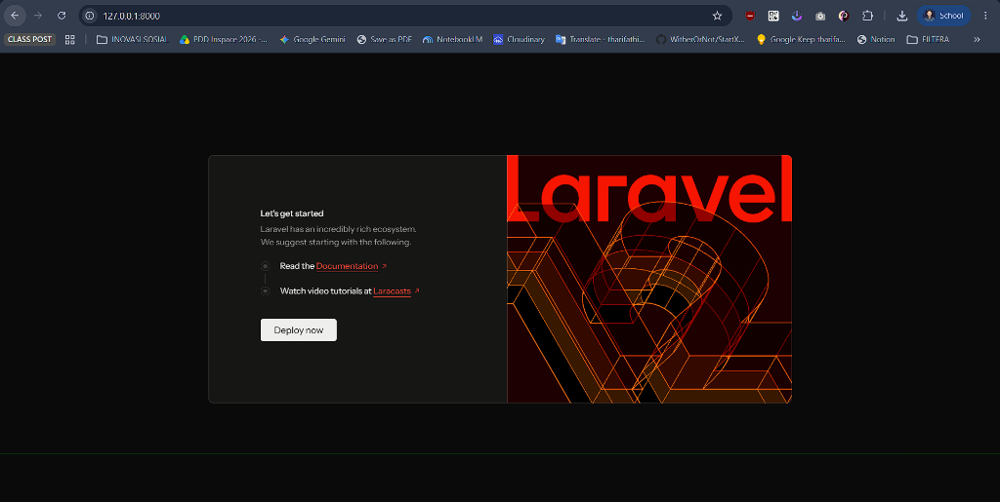
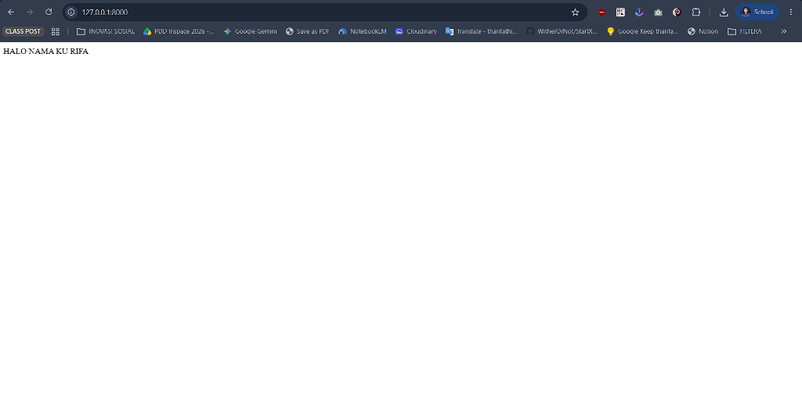
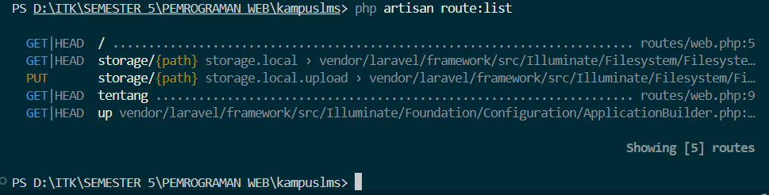
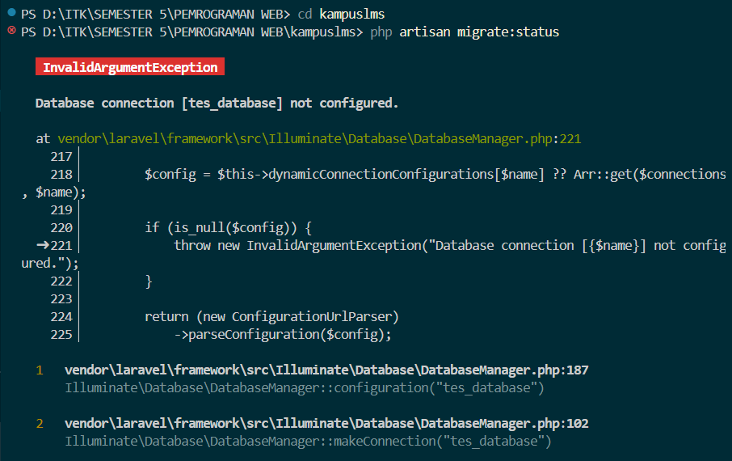
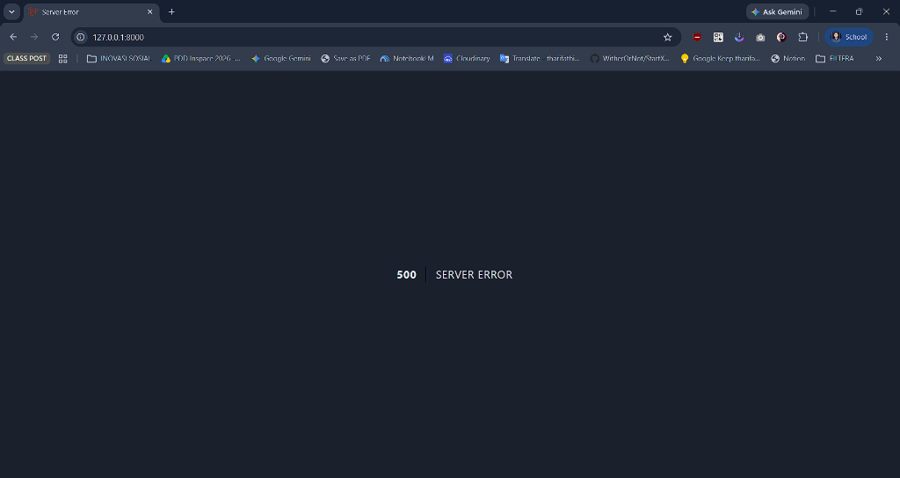

# Catatan Praktikum Minggu 1

**Nama:** Muhammad Rifa Al Rizqul Aulia  
**NIM:** 10241050

---

## READ

### Analisis Berkas `public/index.php`

```php
<?php
error_reporting(E_ALL & ~E_NOTICE & ~E_DEPRECATED);
use Illuminate\Foundation\Application;
use Illuminate\Http\Request;

define('LARAVEL_START', microtime(true));

// Determine if the application is in maintenance mode...
if (file_exists($maintenance = __DIR__.'/../storage/framework/maintenance.php')) {
    require $maintenance;
}

// Register the Composer autoloader...
require __DIR__.'/../vendor/autoload.php';

// Bootstrap Laravel and handle the request...
/** @var Application $app */
$app = require_once __DIR__.'/../bootstrap/app.php';

$app->handleRequest(Request::capture());
```

Berkas ini adalah satu-satunya pintu masuk seluruh HTTP request. Web server diarahkan agar semua URL menuju berkas ini, lalu ia mencatat waktu mulai request, memeriksa mode pemeliharaan, dan memuat autoloader Composer agar seluruh kelas package tersedia. Selanjutnya, `bootstrap/app.php` dijalankan untuk membangun instance aplikasi Laravel beserta konfigurasi routing, middleware, dan exception handler. Terakhir, `$app->handleRequest(Request::capture())` menangkap semua data request masuk (URL, method, header, body) lalu memprosesnya melalui Laravel hingga menghasilkan HTTP response yang dikirim balik ke browser.

---

### Analisis Berkas `bootstrap/app.php`

```php
<?php

use Illuminate\Foundation\Application;
use Illuminate\Foundation\Configuration\Exceptions;
use Illuminate\Foundation\Configuration\Middleware;

return Application::configure(basePath: dirname(__DIR__))
    ->withRouting(
        web: __DIR__.'/../routes/web.php',
        commands: __DIR__.'/../routes/console.php',
        health: '/up',
    )
    ->withMiddleware(function (Middleware $middleware) {
        //
    })
    ->withExceptions(function (Exceptions $exceptions) {
        //
    })->create();
```

Di Laravel 12, berkas ini adalah **pusat konfigurasi utama** — pengganti peran `app/Http/Kernel.php` yang ada di Laravel versi lama. Berikut alurnya baris per baris:

| Baris | Kode | Fungsi |
|-------|------|--------|
| 3–5 | `use Illuminate\Foundation\Application` dst. | Mendaftarkan alias untuk tiga class utama yang dibutuhkan berkas ini. |
| 7 | `Application::configure(basePath: dirname(__DIR__))` | Membuat *builder* konfigurasi aplikasi baru. Parameter `basePath` memberi tahu Laravel di mana root proyek berada (`dirname(__DIR__)` berarti satu folder di atas `bootstrap/`, yaitu folder `kampuslms/`). |
| 8–12 | `->withRouting(...)` | Mendaftarkan tiga hal: `web:` menunjuk berkas `routes/web.php` sebagai daftar URL halaman web; `commands:` menunjuk `routes/console.php` untuk Artisan command; `health: '/up'` mendaftarkan rute `/up` secara otomatis sebagai endpoint pengecekan status aplikasi. |
| 13–15 | `->withMiddleware(function (...) {})` | Titik untuk mendaftarkan middleware global, grup middleware, atau alias. Karena isinya kosong, Laravel memakai susunan middleware bawaan framework. |
| 16–18 | `->withExceptions(function (...) {})->create()` | Titik untuk mengustomisasi cara Laravel menangani dan melaporkan exception. `->create()` mengakhiri proses konfigurasi dan membangun instance `Application` yang siap dipakai — inilah objek `$app` yang dikembalikan ke `public/index.php`. |

---

### Analisis `routes/web.php`

```php
<?php

use Illuminate\Support\Facades\Route;

Route::get('/', function () {
    return view('welcome');
});

Route::get('/tentang', function () {
    return view('tentang');
});
```

Berkas ini adalah daftar semua URL yang dikenali aplikasi beserta tindakan yang harus diambil. Berikut alurnya:

| Baris | Kode | Fungsi |
|-------|------|--------|
| 3 | `use Illuminate\Support\Facades\Route` | Mengimpor facade `Route` agar bisa dipanggil dengan singkat `Route::get(...)` daripada menulis namespace penuh. |
| 5–7 | `Route::get('/', function () { return view('welcome'); })` | Mendaftarkan rute untuk URL `/` (halaman root). Saat browser membuka `/`, Laravel menjalankan closure ini dan mengembalikan tampilan dari berkas `resources/views/welcome.blade.php`. |
| 9–11 | `Route::get('/tentang', function () { return view('tentang'); })` | Mendaftarkan rute untuk URL `/tentang`. Saat browser membuka `/tentang`, Laravel mengembalikan tampilan dari berkas `resources/views/tentang.blade.php`. |

* **Uji Perubahan Response Route:**
  Mencoba mengubah response route `/` langsung menjadi string teks:
  ```php
  Route::get('/', function () {
      return 'HALO NAMA KU RIFA';
  });
  ```
  **Tampilan Awal di Browser (sebelum diubah):**
  

  **Tampilan Setelah Diubah & Di-refresh:**
  

* **Kesimpulan:** Browser langsung memuat respons baru saat halaman di-*refresh*, membuktikan bahwa alur request dari browser ke URL `/` sepenuhnya dikontrol oleh definisi rute di berkas ini — tanpa perlu restart server.

---

### Hasil Perintah `php artisan route:list`

Keluaran terminal saat menjalankan perintah `php artisan route:list`:



**Pencocokan dengan isi `routes/web.php`:**
* **`GET|HEAD /`** $\rightarrow$ Didefinisikan pada `routes/web.php` (baris ke-5) untuk menangani request root menuju halaman welcome.
* **`GET|HEAD tentang`** $\rightarrow$ Didefinisikan pada `routes/web.php` (baris ke-9) untuk menangani request menuju rute `/tentang`.

---

## BREAK

| # | Yang Dirusak | Prediksi Anda sebelum mencoba | Pesan Error Sebenarnya |
|---|--------------|-------------------------------|------------------------|
| 1 | Ganti nama `.env` menjadi `.env.bak` | Server mendeteksi hilangnya berkas konfigurasi lokal dan server otomatis terhenti atau error. | <br>`php artisan serve exited with code 1` |
| 2 | Kosongkan nilai `APP_KEY` di `.env` | Aplikasi menolak memproses enkripsi session/cookie dan memunculkan exception fatal. | <br>`Illuminate\Encryption\MissingAppKeyException: No application encryption key has been specified.` |
| 3 | Ubah `DB_DATABASE` / `DB_CONNECTION` ke nama yang tidak ada | Koneksi ke database gagal saat query/migrasi dijalankan dan menampilkan pesan exception. | **Di Terminal (`php artisan migrate:status`):**<br><br><br>**Di Browser (`APP_DEBUG=true`):**<br><br>`InvalidArgumentException: Database connection [tes_database] not configured.` |
| 4 | Ubah `APP_DEBUG=false`, lalu ulangi nomor 3 | Halaman web hanya menampilkan pesan error umum 500 tanpa memperlihatkan detail kode. | <br>`500 \| SERVER ERROR` |

---

## FIX: Perbaikan Proyek Cacat (Branch `w01`)

*repo `kampuslms-broken` tidak ada sama sekali :(*

---

## BUILD

1. Menghubungkan repositori kelompok `https://github.com/muhammadzaldysyahfiraz/kampuslms-kelompok-05` dan menerapkan *Branch Protection Rule* pada branch `main` (wajib *Pull Request* dan minimal 1 *Approving Review*).
2. Menjalankan Laravel 12 pada PHP 8.3/8.4 dengan basis data MySQL `kampus_db` di Laragon, serta memastikan template `.env.example` terdokumentasi tanpa mengekspos berkas rahasia `.env`.
3. Menulis dokumentasi resmi proyek KampusLMS Kelompok 05 yang memuat deskripsi sistem, tabel 5 anggota (NIM, peran, akun GitHub), prasyarat sistem, dan langkah instalasi lokal.
4. Mendaftarkan rute baru `Route::get('/tentang', ...)` pada berkas `routes/web.php` dan merancang tampilan web modern pada `resources/views/tentang.blade.php` untuk menampilkan identitas tim dan mata kuliah.
5. Mengerjakan perubahan pada branch kerja `dev-rifa`, melakukan push ke remote, membuka Pull Request (#1), mendapatkan *approval review*, dan berhasil melakukan *merge* ke branch `main`.

---

## Checkpoint (CATATAN)

1. Browser $\rightarrow$ Web Server $\rightarrow$ `public/index.php` $\rightarrow$ `bootstrap/app.php` $\rightarrow$ Middleware $\rightarrow$ Routing (`routes/web.php`) $\rightarrow$ Controller/Closure $\rightarrow$ Model (Database) $\rightarrow$ View (Blade) $\rightarrow$ HTTP Response $\rightarrow$ Browser.
2. Hanya folder `public/` yang boleh diekspos ke publik agar berkas sensitif seperti `.env`, logika kode di `app/`, migrasi di `database/`, dan log di `storage/` tidak dapat diunduh langsung oleh siapa pun melalui browser.
3. `.env` memuat nilai rahasia aktual dan bersifat lokal sehingga tidak boleh di-push ke Git. `.env.example` hanyalah cetak biru template variabel tanpa nilai rahasia yang wajib di-push ke repositori.
4. Laravel 11 dan 12 menyederhanakan struktur folder dengan menghapus `app/Http/Kernel.php` dan memindahkan registrasi middleware ke `bootstrap/app.php`.
5. Jika terjadi error, Laravel akan menampilkan halaman debug interaktif lengkap dengan isi variabel lingkungan, query database, password DB, dan struktur direktori server kepada pengunjung.
6. **Bukti Commit (`git log`):**  
   Perintah terminal: `git log -n 3`
   ```text
   commit 1ffcdecf9549cb7b1a54a3d657df1efaee2bbb95
   Merge: bb9d883 3473f3a
   Author: Muhammad Farin Murtadho Syafiq <yoasobi.soca@gmail.com>
   Date:   Sun Aug 30 16:42:19 2026 +0800

       Merge pull request #1 from muhammadzaldysyahfiraz/dev-rifa
       
       docs: tambah catatan minggu 1 rifa, README tentang kelompok, dan buat halaman serta rute tentang

   commit 3473f3a8c665cd2bea6edb9ef3cff5b69f7fc405
   Author: rifarizqul-itk <10241050@student.itk.ac.id>
   Date:   Sun Aug 30 16:30:04 2026 +0800

       docs: tambah catatan minggu 1 rifa, README tentang kelompok, dan buat halaman serta rute tentang
   ```
