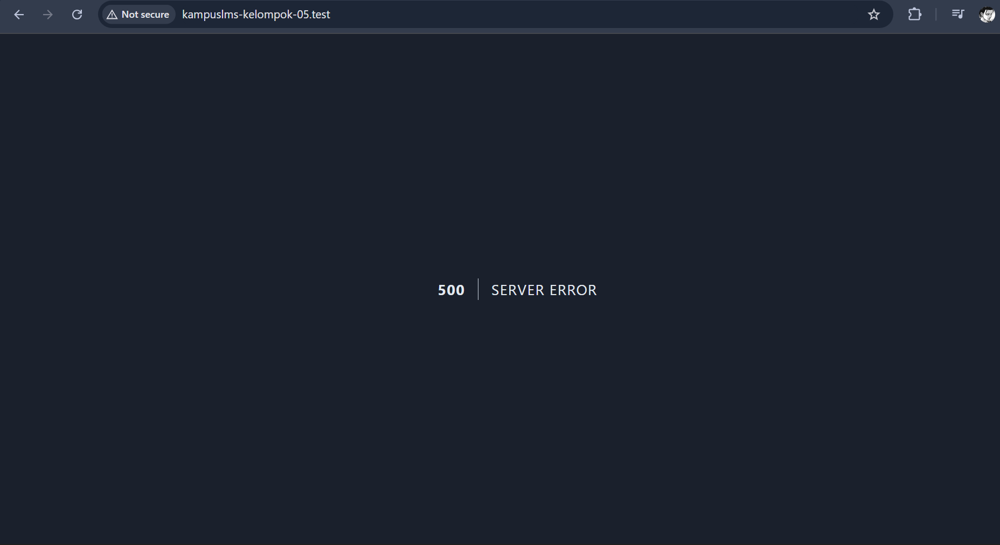
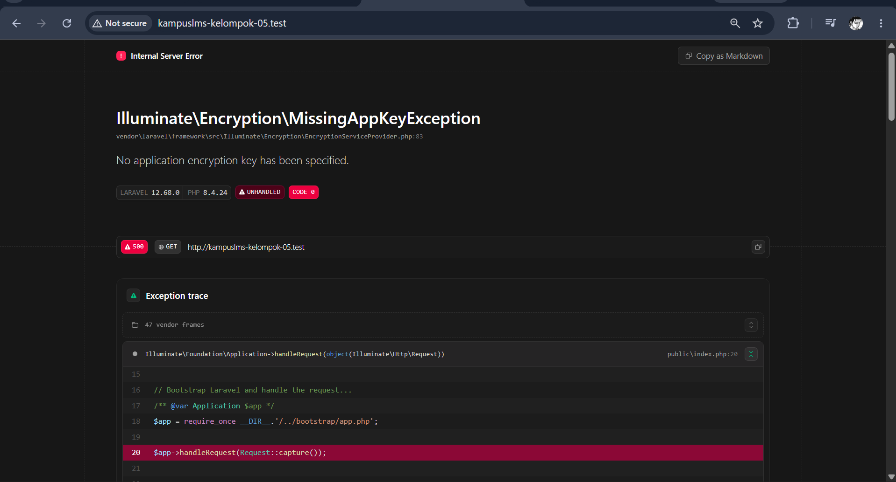
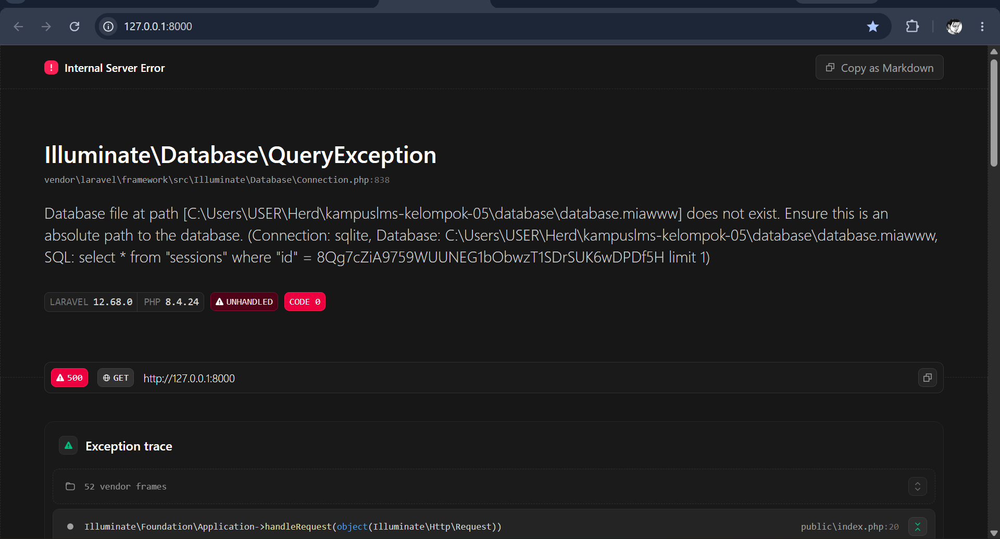
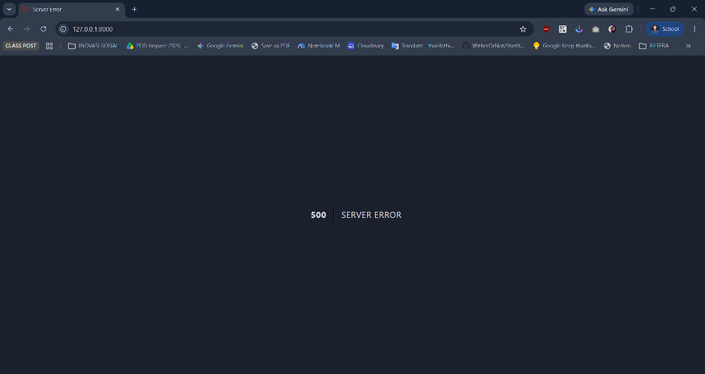

# Catatan Minggu 1 Pemrograman Web
---

Nama: Muhammad Yuspa Ardiansyah

NIM: 10241052
### READ


#### 1. Analisis `public/index.php`


**Hasil Analisis:**


Berkas `public/index.php` merupakan titik awal ketika aplikasi Laravel ini menerima sebuah request. Pertama, berkas ini mencatat waktu dimulainya aplikasi melalui `LARAVEL_START` dan memeriksa apakah terdapat file `maintenance.php` untuk mengetahui apakah aplikasi sedang berada dalam mode pemeliharaan.


Setelah itu, Laravel memuat Composer autoloader melalui `vendor/autoload.php` agar class dan package yang dibutuhkan aplikasi dapat digunakan. Selanjutnya, konfigurasi aplikasi dari `bootstrap/app.php` dimuat untuk membentuk instance aplikasi Laravel.


Pada bagian terakhir, `Request::capture()` digunakan untuk mengambil request yang dikirim oleh browser, kemudian request tersebut diteruskan ke aplikasi melalui `$app->handleRequest()` agar dapat diproses dan menghasilkan response yang nantinya dikirim kembali kepada pengguna.


#### 2. Analisis `bootstrap/app.php`


**Hasil Analisis:**


Berkas `bootstrap/app.php` digunakan untuk melakukan konfigurasi awal dan membentuk aplikasi Laravel. Di dalamnya terdapat beberapa bagian utama yang memiliki fungsi berbeda:


- **Route:** Diatur melalui `->withRouting()`. Bagian ini menentukan lokasi file yang berisi route web dan route untuk perintah console. Selain itu, terdapat `health: '/up'` yang menyediakan endpoint untuk pemeriksaan kondisi aplikasi.


- **Middleware:** Diatur melalui `->withMiddleware()`. Bagian ini menjadi tempat untuk melakukan konfigurasi middleware, yaitu lapisan yang dapat digunakan untuk memproses request sebelum diteruskan ke bagian aplikasi berikutnya.


- **Exception:** Diatur melalui `->withExceptions()`. Bagian ini digunakan untuk melakukan konfigurasi terhadap penanganan exception atau kesalahan yang terjadi selama aplikasi berjalan.


#### 3. Analisis `routes/web.php`


**Hasil Percobaan:**


Pada file `routes/web.php`, terdapat route dengan alamat `/` yang digunakan sebagai halaman utama aplikasi. Route tersebut menggunakan method `GET` dan ketika diakses akan menjalankan fungsi yang mengembalikan view `welcome`.


Setelah mengikuti instruksi praktikum, isi fungsi pada route tersebut diubah sehingga halaman utama tidak lagi menampilkan halaman `welcome`, tetapi menampilkan teks yang telah ditentukan yaitu **Halo ini Yuspa**.


#### 4. Analisis `php artisan route:list`


**Hasil Percobaan:**
```php

`PS C:\Users\USER\Herd\kampuslms-kelompok-05> herd php artisan route:list


  GET|HEAD  / ........................................................................................................................................................ routes/web.php:5
  GET|HEAD  storage/{path} ........................................................ storage.local › vendor/laravel/framework/src/Illuminate/Filesystem/FilesystemServiceProvider.php:98
  PUT       storage/{path} ................................................ storage.local.upload › vendor/laravel/framework/src/Illuminate/Filesystem/FilesystemServiceProvider.php:106
  GET|HEAD  tentang .................................................................................................................................................. routes/web.php:9
  GET|HEAD  up ............................................................................ vendor/laravel/framework/src/Illuminate/Foundation/Configuration/ApplicationBuilder.php:219

                                                                                                                                                                     Showing [5] routes                                                                                   
```

Setelah menjalankan perintah `php artisan route:list` melalui terminal, Laravel menampilkan daftar route yang aktif pada aplikasi. Hasil tersebut kemudian dibandingkan dengan route yang terdapat pada `routes/web.php` dan konfigurasi di `bootstrap/app.php`.


- **`GET|HEAD /`** merupakan route halaman utama yang berasal dari `routes/web.php`. Route tersebut menggunakan alamat `/` dan menjalankan fungsi yang telah dimodifikasi pada percobaan sebelumnya.


- **`GET|HEAD up`** berasal dari konfigurasi `health: '/up'` pada method `withRouting()` di `bootstrap/app.php`. Route ini digunakan sebagai jalur pemeriksaan kondisi aplikasi.


- **`GET|HEAD storage/{path}`** dan **`PUT storage/{path}`** merupakan route yang tersedia dari mekanisme internal Laravel untuk menangani kebutuhan terkait penyimpanan file.


Dari hasil tersebut dapat dilihat bahwa perintah `php artisan route:list` menampilkan route yang terdaftar dalam aplikasi, baik route yang dibuat secara langsung pada `routes/web.php` maupun route yang berasal dari konfigurasi dan komponen Laravel.


## BREAK

| # | Yang Dirusak | Prediksi Anda sebelum mencoba | Pesan Error Sebenarnya |
|---|--------------|-------------------------------|------------------------|
| 1 | Mengubah nama `.env` menjadi `.env.bak` | Aplikasi diperkirakan tidak dapat membaca konfigurasi lokal sehingga kemungkinan terjadi error atau aplikasi tidak dapat berjalan normal. | Aplikasi tidak dapat dijalankan karena berkas .env tidak ditemukan, sehingga konfigurasi lingkungan Laravel tidak dapat dimuat.<br>
| 2 | Menghapus nilai `APP_KEY` di `.env` | Sistem diperkirakan gagal melakukan proses enkripsi pada session/cookie sehingga akan muncul exception.| Muncul `Illuminate\Encryption\MissingAppKeyException` dengan pesan `No application encryption key has been specified.` yang menunjukkan bahwa `APP_KEY` belum ditentukan.|
| 3 | Mengganti `DB_DATABASE` / `DB_CONNECTION` dengan nama database yang tidak ada | Aplikasi diperkirakan tidak dapat terhubung ke database ketika melakukan query atau migrasi sehingga menghasilkan pesan error. |  Muncul `Internal Server Error (500) atau seperti pada gambar di atas lengkapnya` karena Laravel tidak dapat menemukan file database SQLite yang dikonfigurasi. |
| 4 | Mengatur `APP_DEBUG=false`, kemudian mengulangi nomor 3 | Detail error ini diperkirakan tidak ditampilkan dan halaman hanya menunjukkan pesan `500 Server Error`. | <br> Diatur ke false ya agar detail error disembunyikan. Hal ini wajib saaat produksi untuk mencegah kebocoran kredensial database dan data sensitif ke publik. Sebaliknya, true hanya dipakai saat pengembangan untuk melacak bug aja.| 

---

## FIX: Perbaikan Proyek Cacat (Branch `w01`)

repo `kampuslms-broken` tidak ada


## BUILD

1. Menghubungkan repositori kelompok `https://github.com/muhammadzaldysyahfiraz/kampuslms-kelompok-05` dan menerapkan *Branch Protection Rule* pada branch `main` (wajib *Pull Request* dan minimal 1 *Approving Review*).
2. Menjalankan Laravel 12 pada PHP 8.3/8.4 dengan basis data MySQL `kampus_db` di Laragon, serta memastikan template `.env.example` terdokumentasi tanpa mengekspos berkas rahasia `.env`.
3. Menulis dokumentasi resmi proyek KampusLMS Kelompok 05 yang memuat deskripsi sistem, tabel 5 anggota (NIM, peran, akun GitHub), prasyarat sistem, dan langkah instalasi lokal.
4. Mendaftarkan rute baru `Route::get('/tentang', ...)` pada berkas `routes/web.php` dan merancang tampilan web modern pada `resources/views/tentang.blade.php` untuk menampilkan identitas tim dan mata kuliah.
5. Mengerjakan perubahan pada branch kerja `dev-rifa`, melakukan push ke remote, membuka Pull Request (#1), mendapatkan *approval review*, dan berhasil melakukan *merge* ke branch `main`.

---

---

