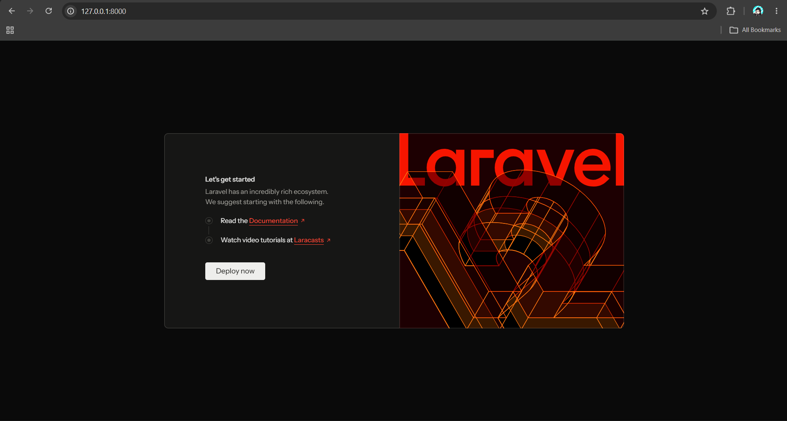
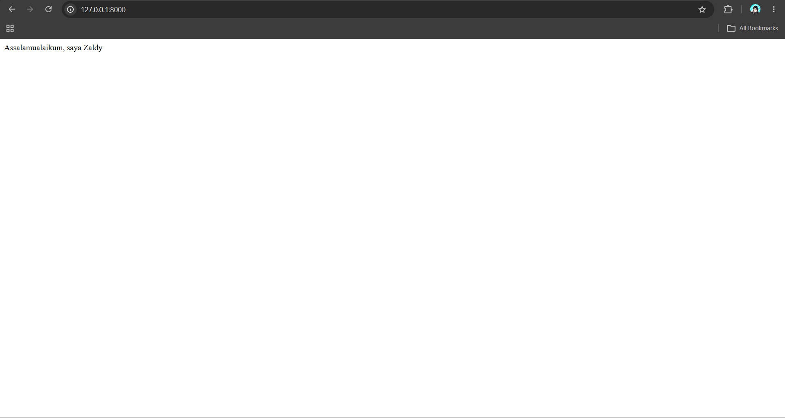
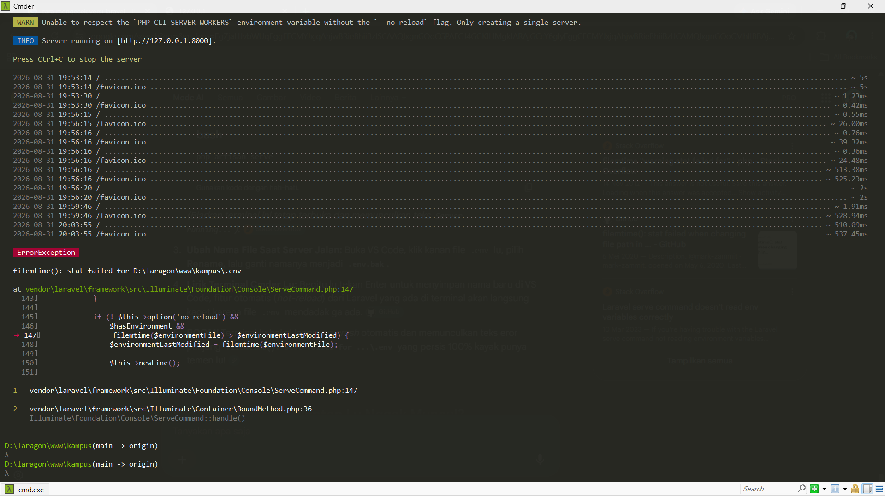
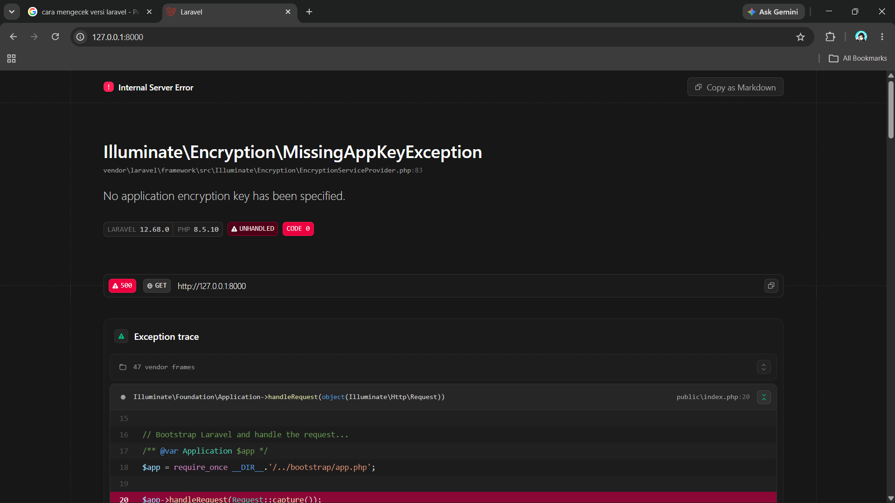
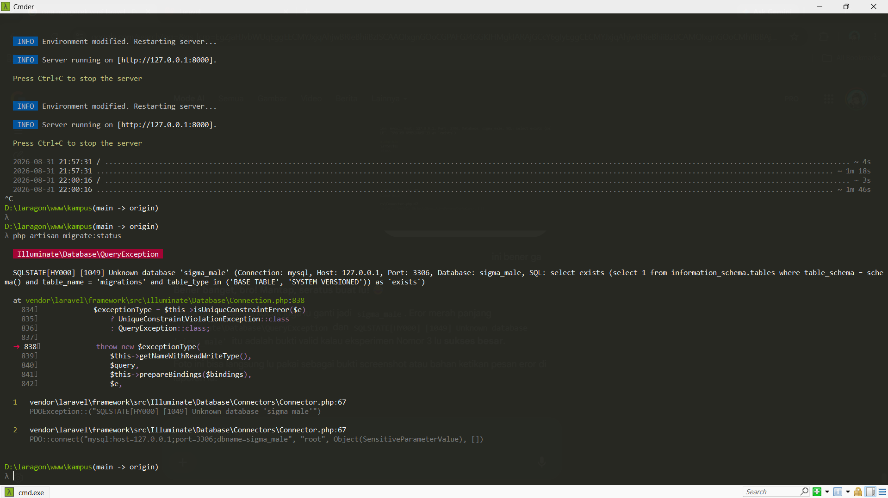
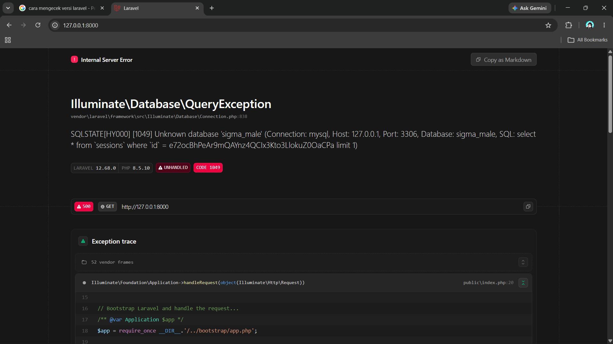
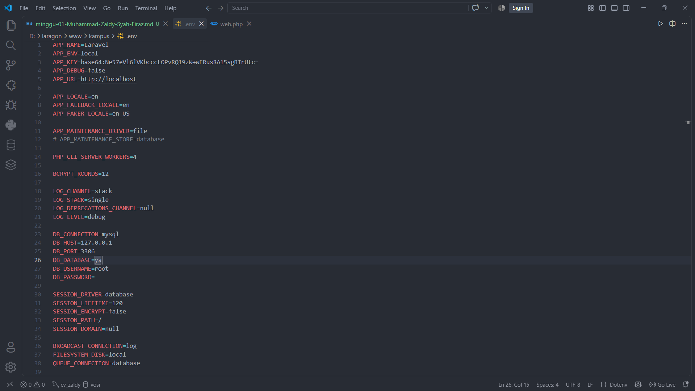
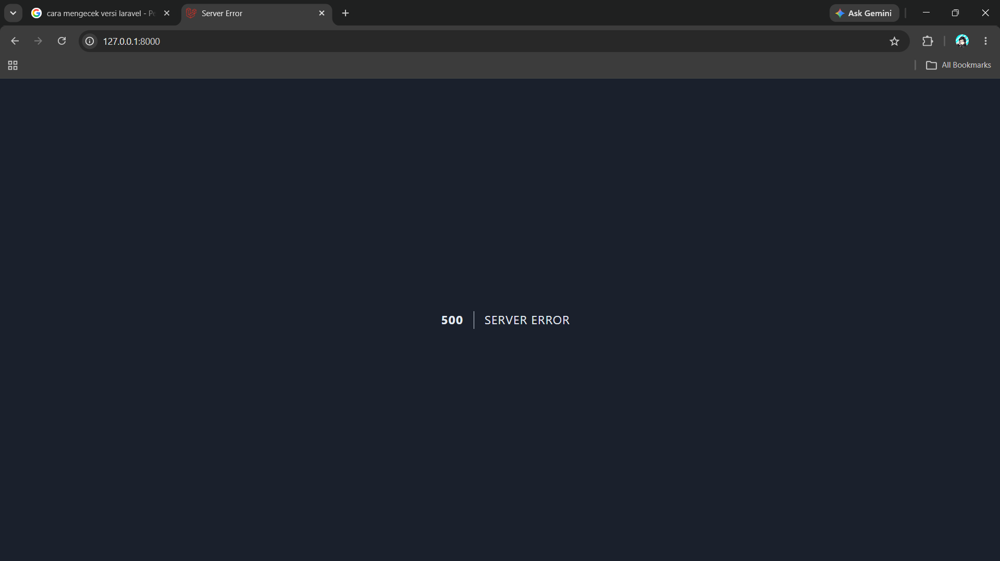

# Catatan Minggu 1 

Nama: Muhammad Zaldy Syah Firaz  
NIM: 10241054 
## Pemrograman Web 
### READ (Bedah Instalasi)  
1. **Buka public/index.php. Baca dari atas ke bawah. Tulis dalam 3 kalimat apa yang dilakukan berkas ini.**  
 Hasil Analisis:  
File ini mencatat waktu awal aplikasi berjalan menggunakan fungsi `define('LARAVEL_START', microtime(true))` dan langsung memeriksa apakah aplikasi sedang dalam mode perbaikan melalui pengecekan file maintenance.php di dalam folder storage.
Selanjutnya, file ini memuat sistem otomatisasi library menggunakan perintah require `__DIR__.'/../vendor/autoload.php'` agar semua komponen kode inti Laravel dan paket eksternal dari Composer dapat langsung dibaca oleh aplikasi. Dan juga berkas ini memanggil konfigurasi utama dari `bootstrap/app.php` untuk menginisialisasi aplikasi, menangkap data permintaan (request) dari browser lewat Request::capture(), dan mengolahnya hingga menghasilkan tampilan halaman web utuh untuk pengguna. 

2. **Buka bootstrap/app.php. Identifikasi bagian mana yang mengurus route, mana yang mengurus middleware, mana yang mengurus exception.**  
   Hasil Analisis:  
   Pada berkas `bootstrap/app.php`, konfigurasi dasar aplikasi dibangun menggunakan tiga metode utama yang saling terhubung:
   *   Bagian Mengurus Route: Diatur oleh metode `->withRouting()`, yang mendaftarkan lokasi berkas rute web (`routes/web.php`), rute konsol/terminal (`routes/console.php`), serta rute kesehatan internal (`/up`).
   *   Bagian Mengurus Middleware: Diatur oleh metode `->withMiddleware()`, yang berfungsi sebagai wadah untuk menyisipkan filter keamanan aplikasi atau pembatasan hak akses halaman.
   *   Bagian Mengurus Exception: Diatur oleh metode `->withExceptions()`, yang digunakan sebagai pusat pengaturan penanganan eror (*error handling*) dan kustomisasi pesan kesalahan jika aplikasi mengalami kendala teknis.
3. **Buka routes/web.php. Temukan route yang menghasilkan halaman selamat datang. Ubah teksnya, muat ulang browser, pastikan berubah.**  
   Hasil Percobaan:  
   Setelah membuka `routes/web.php`, dapat diidentifikasi bahwa rute bawaan (`/`) bertugas memanggil halaman selamat datang (*welcome page*). Berdasarkan instruksi, fungsi tersebut diubah agar mengembalikan sebuah teks string biasa di tampilan. Berikut adalah tampilan sebelum dan sesudahnya:  
   * Sebelum  
        
      Berikut adalah tampilan home sebelum di ubah fungsi dari file `web.php` di dalam folder `routes`.  
   * Sesudah  
        
      Berikut adalah tampilan home sesudah di ubah fungsi dari file `web.php` di dalam folder `routes`.  
4. **Jalankan php artisan route:list. Cocokkan keluarannya dengan isi routes/web.php.**  
   Hasil Percobaan:  

   Ketika menjalankan perintah `php artisan route:list` di terminal, sistem menampilkan total 4 rute bawaan yang aktif pada proyek Laravel 12 ini (*Showing [4] routes*). Berikut adalah hasil analisis kecocokannya dengan berkas proyek:

   *   **`GET\|HEAD /`** sesuai dengan berkas `routes/web.php` pada baris ke-5. Rute ini menangkap permintaan halaman utama root yang telah saya modifikasi fungsinya agar mengembalikan teks string kustom (bukan lagi memanggil `view welcome` bawaan).
   *   **`GET\|HEAD up`** sesuai dengan konfigurasi otomatis pada berkas `bootstrap/app.php` di dalam metode `withRouting(health: '/up')` yang berfungsi sebagai jalur pengecekan kesehatan `health check` aplikasi.
   *   **`GET\|HEAD storage/{path}` & `PUT storage/{path}`** merupakan rute internal bawaan framework dari komponen `FilesystemServiceProvider` untuk mengelola hak akses berkas pada penyimpanan lokal proyek.   
   Hasil pengujian ini membuktikan bahwa keluaran terminal membaca secara akurat seluruh rute, baik di rute kustom yang ditulis di `routes/web.php` maupun rute bawaan sistem Laravel 12.

### BREAK (Rusak dengan sengaja)  
| Nomor | Skenario  | Prediksi Anda sebelum mencoba | Pesan Error Sebenarnya | Analisis |  
|---|-----------------------|-------------------------------|------------------------|---|  
| 1. | Ganti nama `.env` menjadi `.env.bak`| Website akan kehilangan semua konfigurasi dasar seperti koneksi database, app key dan kemungkinan besar akan mendeteksi driver database bawaan yaitu SQLite atau menampilkan halaman error terkait hilangnya app key.|  | Eror ini bisa terjadi karena fitur _hot-reload_ bawaan dari perintah `php artisan serve` secara berkala memantau perubahan pada file `.env` menggunakan fungsi `filemtime()`. Ketika nama file diubah menjadi `.env.bak`, fungsi pengecekan waktu modifikasi tersebut gagal menemukan file asli `.env`, menyebabkan fungsi `stat()` gagal, memicu `ErrorException`, dan langsung mematikan server lokal secara paksa dengan kode _exited with code 1_. |  
|2. | Kosongkan nilai `APP_KEY` di `.env` | Halaman web akan langsung crash dan memunculkan eror terkait masalah enkripsi. Karena APP_KEY bersifat penting untuk mengamankan data sesi dan token keamanan internal framework Laravel.| | `APP_KEY` bertindak sebagai kunci utama untuk algoritma enkripsi internal Laravel seperti mengamankan token sesi, hashing password, dan cookie. Ketika browser meminta request masuk ke server, aplikasi mencoba menmulai keamanan sistem. Karena nilainya dikosongkan pada .env, framework Laravel mendeteksi bahaya keamanan yang fatal, melempar pesan `RuntimeException`, dan langsung menghentikan paksa seluruh aktivitas server lokal di terminal. |
|3.| Ubah `DB_DATABASE` menjadi nama yang tidak ada| Koneksi ke database akan gagal saat query dijalankan | `Tampilan di terminal` . `Tampilan di website`  | Ketika perintah berbasis database seperti `php artisan migrate:status` dijalankan di terminal, Laravel mencoba menghubungi server `MySQL (127.0.0.1:3306)` dan mencari database bernama sigma_male. Karena database tersebut tidak pernah dibuat di `HeidiSQL`, `MySQL` menolak koneksi tersebut dengan kode `eror 1049 (Unknown database)`, yang kemudian ditangkap oleh Laravel dan dilempar sebagai `QueryException`. |  
|4. | Ubah `APP_DEBUG=false`, lalu ulangi nomor 3 | Web akan menampilkan pesan error tanpa debug/ kode error| Perubahan pada kode   Perubahan pada tampilan web | Ketika perintah pada `APP_DEBUG` diubah menjadi `false`, maka website tidak akan menampilkan hasil debug error code pada tampilan web. Hal ini disebabkan karena perintah untuk menampilkan debug error pada tampilan web di nonaktifkan, sehingga jika terdapat perubahan/kerusakan pada baris kode (pada contoh ini, nama database di ubah), website tidak akan menampilkan letak kesalahan kode di tampilan web, tetapi hanya akan menampilkan `500  SERVER ERROR` |