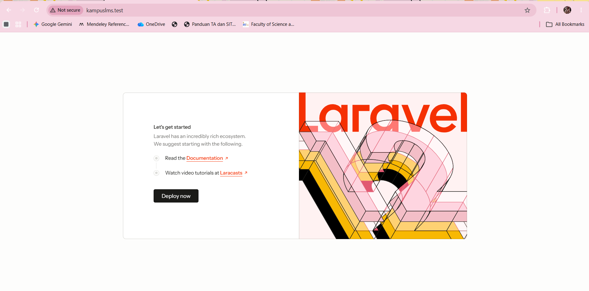
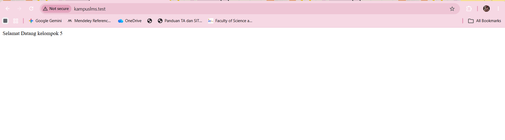
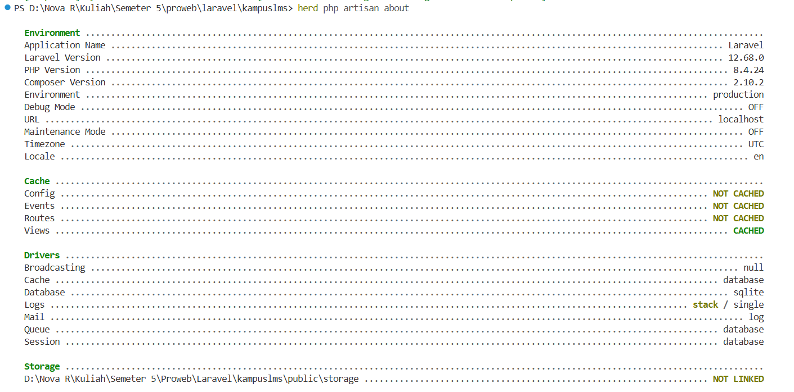
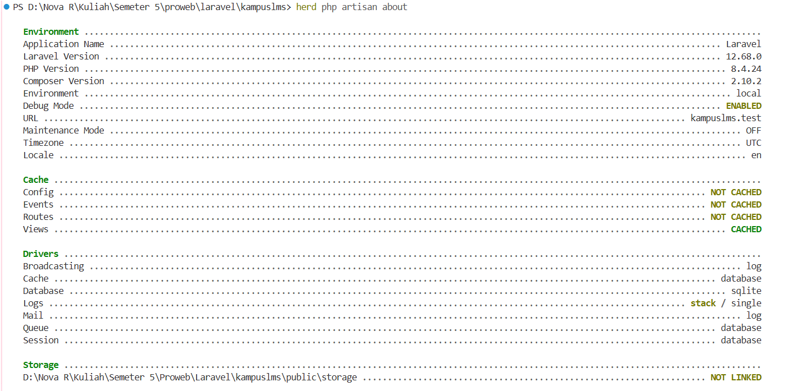
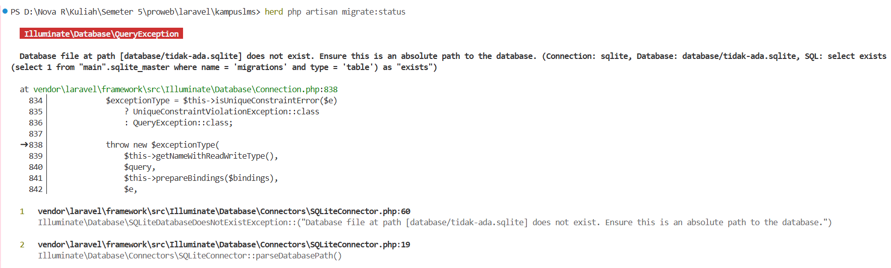
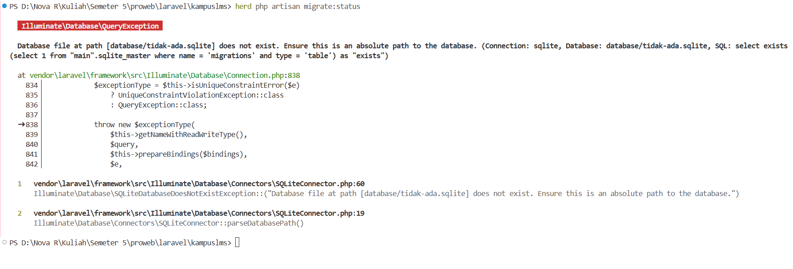

# Catatan Praktikum Minggu 1

**Mata Kuliah:** Pemrograman Web

**Nama:** Nova Reskianti

**NIM:** 10241058

---

## READ: Bedah Instalasi Laravel 12

### 1. `public/index.php.` Baca dari atas ke bawah. Tulis dalam 3 kalimat apa yang dilakukan berkas ini.

1. Mencatat waktu ketika aplikasi mulai dijalankan untuk mengetahui kapan proses aplikasi dimulai.
2. Memuat library dan class yang dibutuhkan oleh Laravel agar aplikasi dapat menjalankan berbagai fungsi yang tersedia.
3. Menerima request dari browser, kemudian meneruskannya ke Laravel untuk diproses dan menghasilkan halaman atau response yang sesuai.

---

### 2. `bootstrap/app.php.` Identifikasi bagian mana yang mengurus route, mana yang mengurus middleware, mana yang mengurus exception.

1. Route terdapat pada `->withRouting(...).` Bagian ini mengatur alamat atau URL yang bisa dibuka di aplikasi, seperti yang terdapat pada routes/web.php.
2. Middleware terdapat pada `->withMiddleware(...).` Bagian ini digunakan untuk menyaring atau memeriksa request yang diterima sebelum diproses oleh aplikasi.
3. Exception terdapat pada `->withExceptions(...).` Bagian ini digunakan untuk menangani error atau masalah yang terjadi saat aplikasi dijalankan.

---

### 3. `routes/web.php.` Temukan route yang menghasilkan halaman selamat datang. Ubah teksnya, muat ulang browser, pastikan berubah.

Route yang menghasilkan halaman selamat selamat datang :
```php
Route::get('/', function () {
    return view('welcome');
});
```
Tampilan awal welcome page di browser :


Uji coba perubahan Route dengan mengubah response route langsung menjadi string teks:
```php
Route::get('/', function () {
    return 'Selamat Datang Kelompok 5';
});
```
tampilan welcome page di browser setelah uji coba perubahan :


Kesimpulan : Setelah kode pada routes/web.php diubah, browser menampilkan teks baru setelah halaman di-refresh. Hal ini menunjukkan bahwa request dari browser ke URL / diproses oleh route yang telah dibuat di dalam file tersebut.

---
### 4.Jalankan `php artisan route:list.` Cocokkan keluarannya dengan `routes/web.php.`

Perintah yang digunakan :
```php
herd php artisan route:list
```
Hasil dari perintah `php artisan route:list` :

```php
PS D:\Nova R\Kuliah\Semeter 5\proweb\laravel\kampuslms> herd php artisan route:list

  GET|HEAD  / ....................................................................................................................................... routes/web.php:5
  GET|HEAD  storage/{path} ....................................... storage.local › vendor/laravel/framework/src/Illuminate/Filesystem/FilesystemServiceProvider.php:98
  PUT       storage/{path} ............................... storage.local.upload › vendor/laravel/framework/src/Illuminate/Filesystem/FilesystemServiceProvider.php:106
  GET|HEAD  up ........................................................... vendor/laravel/framework/src/Illuminate/Foundation/Configuration/ApplicationBuilder.php:219

                                                                                                                                                    Showing [4] routes
```

Hasil Pencocokan dengan `routes/web.php` : 
| Hasil `route:list` | Isi `routes/web.php` | Keterangan |
|---|---|---|
| `GET\|HEAD` | `Route::get()` | Sama sama mengunakan method `GET` |
| `/` | `'/'` | URL route sama-sama `/` |
| `routes/web.php:5` | Route pada baris ke-5 | Lokasi route sesuai |

Kesimpulan :

Setelah menjalankan `herd php artisan route:list`, saya dapat melihat daftar route yang tersedia pada aplikasi Laravel. Hasilnya menunjukkan bahwa route `/` sesuai dengan `Route::get('/')` pada `routes/web.php` baris ke-5, sehingga dapat dipastikan bahwa route tersebut sudah terdaftar dengan benar.

---

## BREAK : Rusak dengan sengaja 
| # | Yang dirusak | Prediksi Anda sebelum mencoba | Pesan error sebenarnya |
|---|--------------|-------------------------------|------------------------|
| 1 | Ganti nama `.env` menjadi `.env.bak` |Laravel tidak dapat membaca konfigurasi dari file `.env`. |  Laravel tidak menampilkan error, tetapi menggunakan konfigurasi default. `production` menunjukkan aplikasi dianggap berjalan pada mode produksi, `Debug Mode OFF` berarti detail error tidak ditampilkan, sedangkan `URL localhost` menunjukkan konfigurasi URL dari `.env` tidak terbaca.|
| 2 | Kosongkan nilai `APP_KEY` di `.env` | Laravel kemungkinan mengalami error karena tidak memiliki kunci enkripsi yang diperlukan oleh aplikasi.|  Tidak muncul pesan error saat menjalankan `herd php artisan about`. Laravel tetap berjalan dan masih menunjukkan konfigurasi `local`, `Debug Mode ENABLED`, dan URL `kampuslms.test`.  |
| 3 | Ubah `DB_DATABASE` menjadi nama yang tidak ada | Laravel akan mengalami error karena mencoba menggunakan database yang tidak tersedia.  |  Muncul error `Database file at path [database/tidak-ada.sqlite] does not exist.` Laravel tidak dapat mengakses database karena file SQLite yang dituju tidak tersedia.|
| 4 | Ubah `APP_DEBUG=false`, lalu ulangi nomor 3 |Diperkirakan error masih terjadi, tetapi informasi error yang ditampilkan akan lebih sedikit karena mode debug dimatikan. |  Muncul error karena file database `database/tidak-ada.sqlite` tidak ditemukan. Meskipun `APP_DEBUG=false`, detail error tetap ditampilkan di terminal karena perintah dijalankan melalui Artisan.|
---
## FIX Perbaiki proyek yang cacat

**Dosen menyediakan repo `kampuslms-broken.` Pindah ke branch w01 isinya proyek Laravel 12 yang tidak mau jalan. Ada 4 masalah. Temukan dan perbaiki semuanya, lalu kirim Pull Request berisi penjelasan tiap perbaikan. Petunjuk: masalahnya tersebar di berkas konfigurasi, dependensi, dan satu berkas yang seharusnya tidak ada di dalam repo.**

Bagian ini belum dikerjakan karena masih menunggu tautan repository kampuslms-broken dan instruksi dari Dosen/Asisten Dosen.

## BUILD

Bagian BUILD sudah dikerjakan oleh anggota kelompok lain, mulai dari pembuatan repository, instalasi Laravel 12, pembuatan README, pengaturan .env, commit anggota, branch protection, hingga pembuatan route /tentang.

## Checkpoint Minggu 1

### 1. Sebutkan urutan berkas yang dilewati sebuah request dari browser sampai HTML kembali.

   Request dari browser masuk melalui `public/index.php`, kemudian diproses oleh `bootstrap/app.php`, dilanjutkan ke `routes/web.php` untuk menentukan route yang sesuai. Setelah itu request diproses oleh controller jika digunakan, lalu mengambil data melalui model/database dan menghasilkan view. Hasilnya kemudian dikembalikan ke browser dalam bentuk HTML.

---

### 2. Kenapa hanya folder `public/` yang boleh diakses dari internet? Apa yang terjadi kalau seluruh folder proyek diekspos?

   Karena `public/` berisi file yang memang boleh diakses pengguna, seperti `index.php`, CSS, dan JavaScript. Jika seluruh folder proyek diekspos, file penting seperti `.env`, source code, dan konfigurasi database dapat dilihat orang lain sehingga dapat menimbulkan masalah keamanan.

---

### 3. Apa beda `.env` dan `.env.example`, dan kenapa hanya satu yang di-commit?

   `.env` berisi konfigurasi dan informasi rahasia seperti `APP_KEY` dan database, sedangkan `.env.example` hanya berisi contoh konfigurasi tanpa nilai rahasia. Karena itu, `.env.example` boleh di-commit, sedangkan `.env` tidak boleh di-commit.

---

### 4. Di Laravel 12, di berkas mana middleware didaftarkan? Kenapa jawabannya berbeda dari kebanyakan tutorial di internet?

   Pada Laravel 12, middleware didaftarkan di `bootstrap/app.php`. Hal ini berbeda dari tutorial lama karena Laravel 11 ke atas sudah tidak menggunakan `app/Http/Kernel.php` untuk mendaftarkan middleware.

   ---


### 5. Apa risiko konkret `APP_DEBUG=true` di server produksi?

   Jika `APP_DEBUG=true`, ketika terjadi error Laravel dapat menampilkan informasi teknis seperti lokasi file, kode, dan detail error. Informasi tersebut dapat dimanfaatkan oleh pihak yang tidak berwenang sehingga berisiko terhadap keamanan aplikasi.
   
   ---

### 6. Tunjukkan di `git log` bahwa Anda punya commit atas nama Anda sendiri.
