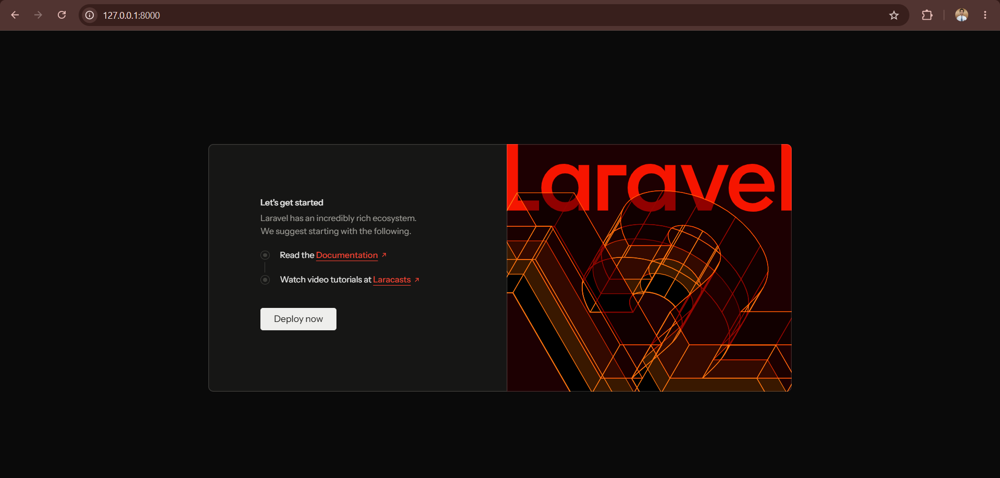
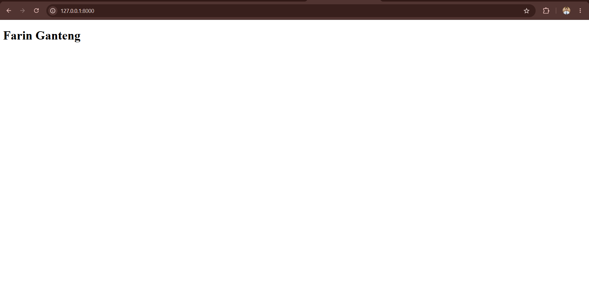
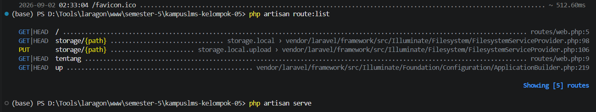

1. `public/index.php` menjadi pintu masuk utama setiap request yang masuk ke aplikasi Laravel. Berkas `index.php` menyiapkan Laravel dengan memuat autoloader Composer melalui `require __DIR__.'/../vendor/autoload.php';` dan membuat atau configure Application melalui `$app = require_once __DIR__.'/../bootstrap/app.php';`. Setelah itu, menangkap request dari user dan menyerahkannya kepada Laravel untuk diproses melalui `$app->handleRequest(Request::capture());`.

2.  
    ```
    return Application::configure(basePath: dirname(__DIR__))
    ->withRouting(
        web: __DIR__.'/../routes/web.php',
        commands: __DIR__.'/../routes/console.php',
        health: '/up',
    )
    ->withMiddleware(function (Middleware $middleware) {
        //
    })
    ->withExceptions(function (Exceptions $exceptions) {
        //
    })->create();
    ```

    </n>Pada boothstrap/app.php, withRouting adalah baris kode yang mengurus routing, withMiddleware adalah baris kode yang mengurus middleware, dan withExceptions adalah baris kode yang mengurus exceptions.

3.  
    ```
    Route::get('/', function () {
        return view('welcome');
    });
    ```

    </n>Pada web.php, baris code ini adalah route yang menghasilkan selamat datang, artinya halaman utama yang akan ditampilkan ketika mengakses aplikasi akan diarahkan ke 'welcome'. Berikut adalah tampilan sebelum dan sesudah teks yang ada pada 'welcome' diubah :
    
    

    

4.  `php artisan route:list` adalah perintah untuk melihat daftar semua route yang terdaftar di aplikasi Laravel. Kita dapat melihat route yang telah dibuat di web.php atau berkas lainnya melalui perintah ini. note : route storage dibuat oleh laravel untuk menyimpan suatu file.

