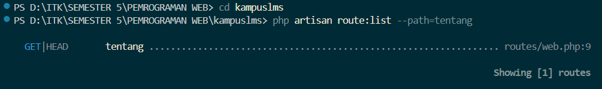
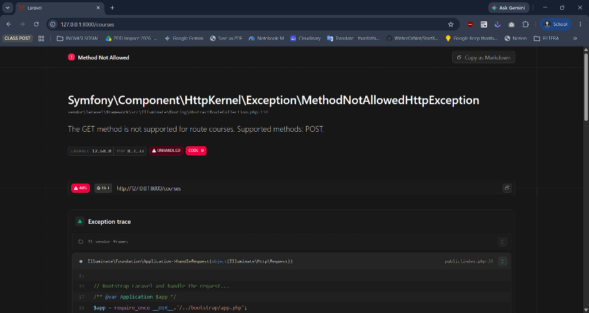
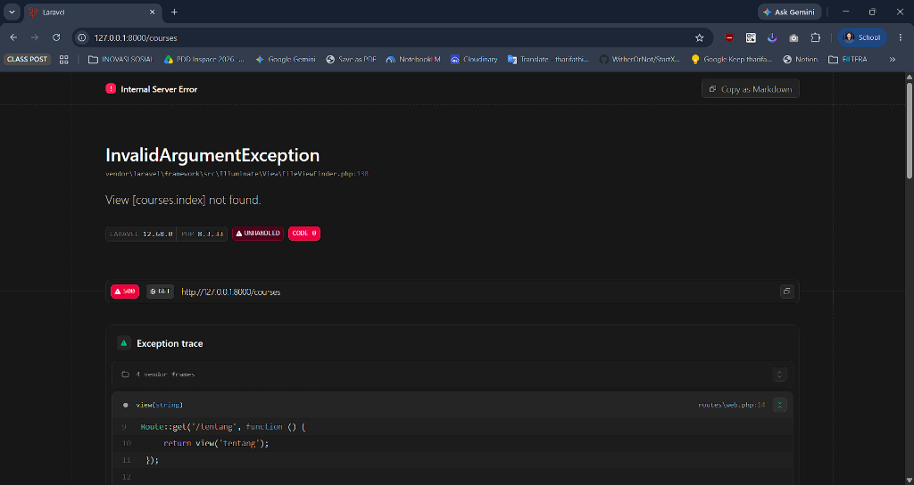
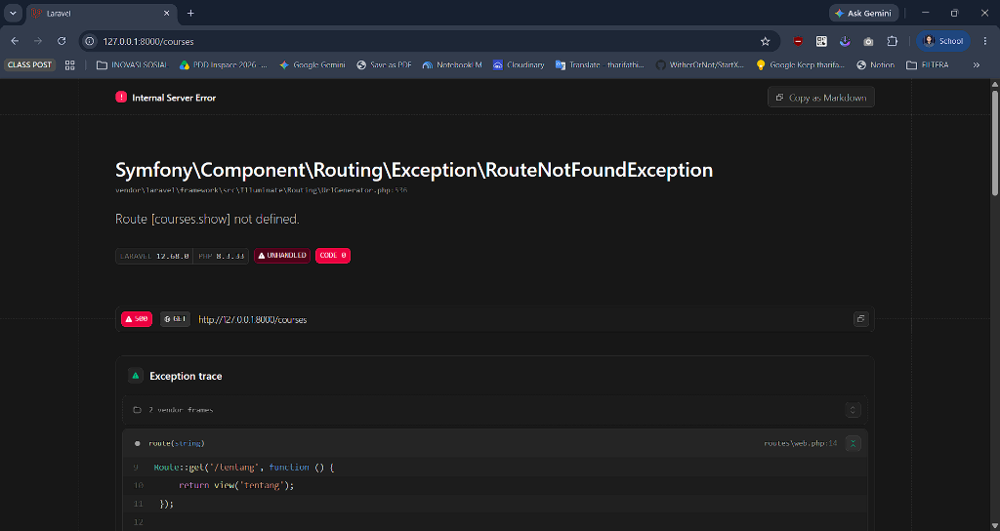
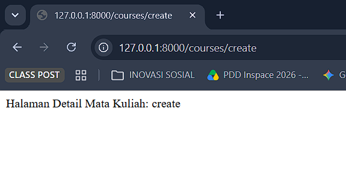
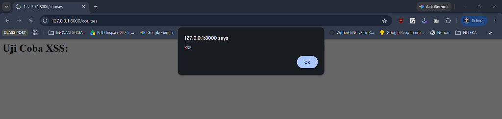
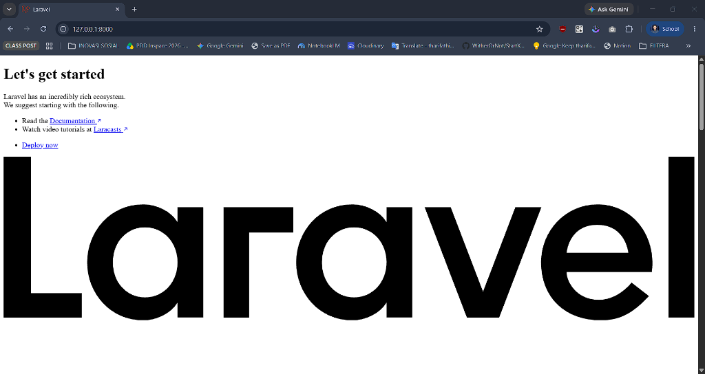

# Catatan Praktikum Minggu 2

**Mata Kuliah:** Pemrograman Web (SI2514024)  
**Nama:** Muhammad Rifa Al Rizqul Aulia  
**NIM:** 10241050  
**Kelompok:** 05  

---

## READ

### 1. Baris mana di `routes/web.php` yang menangkapnya?

Route `/tentang` ditangkap pada baris ke-9 sampai ke-11 di berkas `routes/web.php`:

```php
Route::get('/tentang', function () {
    return view('tentang');
});
```

Baris ini mendefinisikan rute HTTP dengan method `GET` untuk path `/tentang`.

---

### 2. Kalau ditangani controller, berkas dan method mana?

Saat ini route `/tentang` belum menggunakan controller. Request ditangani secara langsung menggunakan fungsi `function () { return view('tentang'); }` di dalam `routes/web.php`. 

Jika nantinya ditangani oleh Controller (misalnya `TentangController`), sintaksnya akan didaftarkan seperti:
```php
Route::get('/tentang', [TentangController::class, 'index'])->name('tentang');
```
di mana berkasnya berada di `app/Http/Controllers/TentangController.php` pada method `index()`.

---

### 3. View mana yang dikembalikan? Di path apa persisnya?

View yang dikembalikan adalah view bernama `'tentang'`, yang dipanggil lewat helper `return view('tentang');`.  
Berkas view tersebut tersimpan di direktori:
`resources/views/tentang.blade.php`

---

### 4. Layout apa yang membungkusnya?

Tidak ada layout yang membungkusnya. Halaman `tentang` saat ini berdiri sendiri, di mana seluruh struktur dokumen HTML (mulai dari `<!DOCTYPE html>`, `<head>`, tag `<style>`, hingga `<body>`) ditulis langsung di dalam berkas `resources/views/tentang.blade.php` tanpa menggunakan layout pembungkus seperti komponen `<x-layout>` maupun `@extends`.

---

### 5. Jalankan `php artisan route:list --path=tentang`. Cocok dengan analisis Anda?

**Perintah Terminal:**
```bash
php artisan route:list --path=tentang
```

**Hasil Terminal:**
  
Hasil terminal cocok dengan analisis:
- Method yang diterima adalah `GET|HEAD` (Laravel otomatis mendukung method `HEAD` untuk setiap route `GET`).
- URL rute adalah `tentang`.
- Berkas controller dan angka baris kodenya merujuk ke `routes/web.php:9`.

---

## BREAK

| # | Yang Dirusak | Yang Dipelajari | Prediksi Anda Sebelum Mencoba | Pesan Error Sebenarnya |
|---|--------------|-----------------|-------------------------------|------------------------------------------|
| 1 | Ubah `Route::get` menjadi `Route::post` pada route daftar mata kuliah | Method HTTP tidak cocok $\rightarrow$ 405 | Browser mengirimkan request `GET` saat URL dibuka, sedangkan server hanya menerima `POST`, sehingga akan menghasilkan error 405. | <br>**405 Method Not Allowed**<br>`The GET method is not supported for route courses. Supported methods: POST.` |
| 2 | Ubah nama view di `return view(...)` menjadi yang tidak ada (misal: `return view('courses.index')`) | Exception view not found | Laravel akan mencari file Blade dengan nama tersebut di `resources/views/` dan memunculkan error karena file tidak ditemukan. | <br>`InvalidArgumentException`<br>`View [courses.index] not found.` |
| 3 | Hapus `->name('courses.show')`, lalu muat halaman yang memakai `route('courses.show')` | Pentingnya penamaan route (*named route*) | Fungsi `route()` tidak dapat menemukan nama rute dalam daftar rute dan melempar *RouteNotFoundException*. | <br>`Symfony\Component\Routing\Exception\RouteNotFoundException`<br>`Route [courses.show] not defined.` |
| 4 | Pindahkan `/courses/{course}` ke ATAS `/courses/create`, lalu buka `/courses/create` | Urutan pendaftaran route menentukan kecocokan (*first match*) | Laravel membaca rute dari atas ke bawah. Kata `'create'` akan dianggap sebagai nilai parameter dinamis `{course}` pada rute pertama, sehingga halaman detail yang terbuka, bukan form buat baru. | <br>Halaman tidak menampilkan form create, melainkan memproses rute detail dengan output:<br>`Halaman Detail Mata Kuliah: create` |
| 5 | Ganti `{{ $nama }}` menjadi `{!! $nama !!}`, isi `$nama` dengan `<script>alert('XSS')</script>` | **Bahaya XSS (Cross-Site Scripting)** | Sintaks `{!! !!}` tidak melakukan *HTML escaping*, sehingga kode script JavaScript jahat akan dieksekusi langsung oleh browser pengguna. | <br>Muncul dialog popup (*alert*) di browser bertuliskan `"xss"`, membuktikan script JavaScript dieksekusi langsung oleh browser. |
| 6 | Hapus `@vite(...)` dari layout | Peran *Asset Bundler* Vite | File CSS dan JavaScript tidak akan terhubung ke halaman HTML, mengakibatkan tampilan polos tanpa gaya (*unstyled*). | <br>Halaman kehilangan seluruh styling CSS dan tata letak menjadi polos berantakan (*unstyled*). |
| 7 | Hentikan `npm run dev` lalu muat ulang halaman (saat mode dev aktif) | Perbedaan dev server vs production build | Browser gagal menyambung ke server lokal Vite (`http://localhost:5173`), mengakibatkan aset CSS/JS terkini tidak dapat di-load. | Browser memunculkan error koneksi ke server Vite atau fallback error terkait manifest/koneksi port 5173.<br>*(Screenshot: `img-rifa/minggu-02-rifarizqul-break-7.png`)* |
| 8 | Panggil `route('courses.show')` tanpa mengirim parameter | Parameter wajib pada URL dinamis | Laravel mewajibkan argumen untuk menggantikan wildcard `{course}` dalam pembentukan string URL. Jika tidak ada, URL generation gagal. | `Illuminate\Routing\Exceptions\UrlGenerationException`<br>`Missing required parameter for [Route: courses.show] [URI: courses/{course}] [Missing parameter: course].`<br>*(Screenshot: `img-rifa/minggu-02-rifarizqul-break-8.png`)* |

---

## FIX: Perbaikan Proyek Cacat (Branch `w02`)

Pada branch `w02` di repositori latihan `kampuslms-broken`, terdapat **6 masalah** yang harus dianalisis dan diperbaiki:

| # | Masalah yang Ditemukan | Lokasi Berkas & Baris | Analisis Risiko | Solusi Perbaikan |
|---|------------------------|-----------------------|-----------------|------------------|
| 1 | Route saling menutupi (urutan salah) | `routes/web.php` | Rute wildcard parameter menangkap path statis sehingga halaman penting tidak pernah bisa diakses. | Pindahkan rute statis (misal `/courses/create`) ke atas rute berparameter (`/courses/{course}`). |
| 2 | Method HTTP tidak semestinya (misal: aksi hapus pakai `GET`) | `routes/web.php` | Link penghapusan dapat dipicu secara tidak sengaja oleh prefetching browser atau web crawler bot. | Ubah rute menjadi method `DELETE` atau `POST` yang dipanggil melalui form dengan token `@csrf`. |
| 3 | URL di-hardcode pada tautan (tidak pakai `route()`) | Blade view | Rentan *broken link* jika prefix URI atau struktur rute diubah di masa depan. | Ganti string URL statis dengan helper `route('nama.route')`. |
| 4 | URL di-hardcode pada navigasi/tombol aksi | Blade view | Menghilangkan fleksibilitas penamaan rute terpusat Laravel. | Standarisasi seluruh hyperlink menggunakan named route. |
| 5 | Penggunaan sintaks raw HTML `{!! !!}` tanpa sanitasi | Blade view | Kerentanan fatal Cross-Site Scripting (XSS) yang memungkinkan eksekusi JavaScript berbahaya di sisi client. | Ganti dengan sintaks aman `{{ }}` agar di-*escape* otomatis via `htmlspecialchars`. |
| 6 | Logika query/bisnis ditaruh di dalam View | Blade view | Melanggar prinsip MVC; view menjadi berat, sulit diuji (*untestable*), dan membocorkan data layer ke presentasi. | Pindahkan seluruh pengambilan data dan logika bisnis ke dalam Controller, lalu oper hasilnya ke View. |

*(Catatan: Jika repositori `kampuslms-broken` belum dipublikasikan oleh pengampu, dokumentasikan analisis 6 risiko di atas sebagai pemenuhan modul).*

---

## BUILD: Kerangka KampusLMS

Implementasi kerangka modul mata kuliah pada proyek KampusLMS:

1. **Komponen Layout Bersama (`resources/views/components/layout.blade.php`):**
   - Menggunakan tag `<x-layout>` sebagai pembungkus utama halaman.
   - Dilengkapi navigasi navbar yang memuat menu: **Dashboard**, **Mata Kuliah**, dan **Tentang**.
   - Menyertakan direktif `@vite(['resources/css/app.css', 'resources/js/app.js'])`.
   - Menggunakan variabel slot `{{ $slot }}` dan `$title`.

2. **Controller Mata Kuliah (`app/Http/Controllers/CourseController.php`):**
   - Dibuat menggunakan perintah: `php artisan make:controller CourseController`.
   - Menyediakan method `index()` untuk menampilkan seluruh daftar mata kuliah (menggunakan data statis array).
   - Menyediakan method `show($id)` untuk menampilkan detail spesifik satu mata kuliah.

3. **View Daftar Mata Kuliah (`resources/views/courses/index.blade.php`):**
   - Memanfaatkan komponen `<x-layout title="Daftar Mata Kuliah">`.
   - Menampilkan tabel responsif dengan kolom: Kode, Nama Mata Kuliah, SKS, Dosen Pengampu, dan Aksi Detail.
   - Menghubungkan tombol detail ke rute menggunakan `route('courses.show', $course['id'])`.

4. **View Detail Mata Kuliah (`resources/views/courses/show.blade.php`):**
   - Menampilkan informasi lengkap satu mata kuliah yang dipilih berdasarkan ID/kode.
   - Menyediakan tombol navigasi kembali ke daftar mata kuliah menggunakan helper `route('courses.index')`.

5. **Pendaftaran Named Routes (`routes/web.php`):**
   - Mendaftarkan rute dengan nama resmi:
     ```php
     Route::get('/courses', [CourseController::class, 'index'])->name('courses.index');
     Route::get('/courses/{course}', [CourseController::class, 'show'])->name('courses.show');
     ```

6. **Halaman 404 Kustom (`resources/views/errors/404.blade.php`):**
   - Dibuat untuk menangani request ke rute atau ID data mata kuliah yang tidak ditemukan, dengan tampilan yang ramah pengguna.

7. **Kolaborasi & Git Workflow:**
   - Dikerjakan melalui branch kerja terpisah, diajukan melalui *Pull Request*, di-review oleh rekan kelompok, dan di-merge ke branch `main`.

---

## Checkpoint Minggu 2

### 1. Kenapa menghapus data lewat `GET` berbahaya? Beri satu skenario konkret.
Method `GET` menurut spesifikasi HTTP bersifat *idempotent* dan *safe* (hanya untuk membaca data tanpa mengubah state di server). Jika penghapusan data dijalankan lewat `GET` (misal `/courses/5/delete`):
- **Skenario konkret:** Web crawler mesin pencari (seperti Googlebot) atau ekstensi browser *accelerator* yang melakukan *link prefetching* otomatis akan mengunjungi setiap link `<a>` di halaman. Begitu link dikunjungi oleh bot, seluruh data mata kuliah di database akan terhapus otomatis tanpa disengaja oleh pengguna. Selain itu, link `GET` dapat dipicu melalui tag `` pada serangan CSRF sederhana.

### 2. Apa yang terjadi kalau `/courses/{course}` ditulis sebelum `/courses/create`? Kenapa?
Laravel mencocokkan rute dari urutan paling atas ke bawah (*first match wins*). Jika `/courses/{course}` ditulis lebih dulu, ketika browser meminta `/courses/create`, kata `'create'` akan dianggap sebagai parameter `{course}`. Akibatnya, method `show` yang dieksekusi dan aplikasi akan mencoba mencari mata kuliah dengan ID/slug bernama `"create"`, bukan membuka halaman form pembuatan data baru.

### 3. Tunjukkan di kode Anda satu tempat yang memakai `route()`. Apa untungnya dibanding URL hardcode?
Contoh pada `resources/views/courses/index.blade.php`:
```blade
<a href="{{ route('courses.show', $course['id']) }}">Lihat Detail</a>
```
**Keuntungannya:** Menghilangkan keterikatan kaku (*loose coupling*). Jika di kemudian hari struktur URL diubah dari `/courses/{course}` menjadi `/akademik/mata-kuliah/{course}`, kita hanya perlu mengubah 1 baris di `routes/web.php` tanpa perlu menyisir dan mengubah puluhan file template Blade di seluruh proyek.

### 4. Apa beda `{{ }}` dan `{!! !!}`? Peragakan XSS yang Anda buat di bagian BREAK.
- `{{ $data }}`: Menjalankan fungsi proteksi `htmlspecialchars()` secara otomatis untuk mengubah karakter berbahaya seperti `<`, `>`, `"` menjadi entitas HTML aman (`&lt;`, `&gt;`). Teks akan tampil persis sebagai tulisan di layar tanpa dieksekusi.
- `{!! $data !!}`: Merender teks mentah (*raw output*) langsung ke dalam DOM HTML tanpa filter/escape.
- **Peragaan XSS:** Jika `$nama = "<script>alert('XSS')</script>"`, keluaran `{{ $nama }}` hanya akan memunculkan teks biasa di layar browser. Namun keluaran `{!! $nama !!}` akan membuat browser menjalankan skrip tersebut dan memunculkan pop-up alert JavaScript secara aktif.

### 5. Apa fungsi `@vite`? Apa beda `npm run dev` dan `npm run build`?
- **Fungsi `@vite`:** Direktif Blade untuk menyuntikkan script loader aset CSS dan JavaScript Vite ke dalam tag `<head>` dokumen HTML.
- **Beda `npm run dev` vs `npm run build`:**
  - `npm run dev`: Menjalankan *development server* lokal (biasanya di port 5173) dengan fitur *Hot Module Replacement* (HMR). Perubahan file CSS/JS langsung ter-update di browser tanpa refresh halaman.
  - `npm run build`: Mengompilasi, me-minifikasi, dan membundel seluruh file aset menjadi berkas produksi statis di folder `public/build/` lengkap dengan manifest hash file untuk performa maksimal di server produksi.

### 6. Jelaskan mengapa data dari `Request` tidak boleh dipercaya.
Semua data yang datang dari pengguna (`$request->input()`, `$request->query()`, header HTTP, cookie) berada di bawah kendali penuh client (frontend). Penyerang dapat dengan mudah memanipulasi parameter URL, mengirim form dengan nilai yang melompati batasan UI, menyuntikkan script jahat, atau memodifikasi request payload menggunakan alat seperti Burp Suite / Postman. Oleh karena itu, backend harus selalu memperlakukan input request sebagai data mentah yang tidak aman dan wajib divalidasi serta di-*sanitize*.

---

### Bukti Riwayat Git (`git log`)
*(Jalankan `git log -n 3` setelah melakukan commit pekerjaan Minggu 2 untuk menyematkan bukti commit Anda).*
