# Catatan Minggu 2 Pemrograman Web
---
---

Nama: Muhammad Yuspa Ardiansyah

NIM: 10241052
<br>
<br>
<br>

# Route
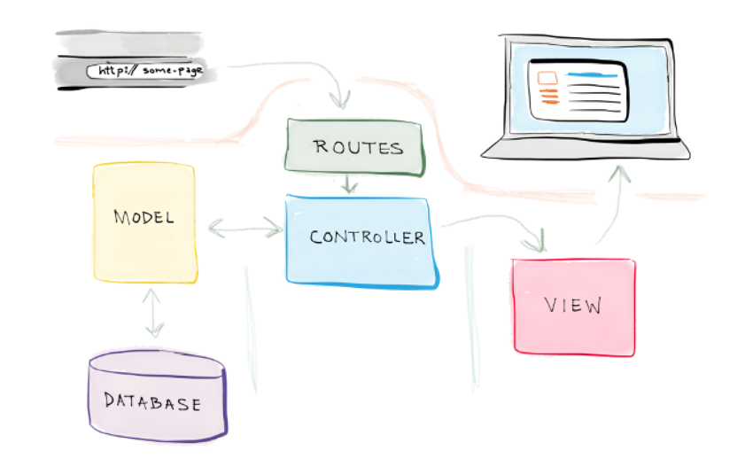

## Route adalah aturan yang menentukan Laravel harus melakukan apa ketika seseorang membuka URL tertentu. Misalnya di routes/web.php ada:
```php
Route::get('/courses', function () {
    return 'Daftar Mata Kuliah';
});

// Route::get artinya Route ini menerima request GET
// /courses artinya URL yang dituju
// function () artinya Apa yang dilakukan ketika URL tersebut dibuka
// return artinya Apa yang dikembalikan ke browser
```
Kurang lebih alurrnya dari Browser > GET /courses > Laravel mencari Route > Route menemukan /courses > Menjalankan function > Menampilkan "Daftar Mata Kuliah" > Dikembalikan lagi ke Browser.

- ## HTTP Method pada Route
Artinya HTTP Method memberi tahu Laravel jenis tindakan yang ingin dilakukan.


| Method | Maksud | Contoh |
|---|---|---|
GET | Ambil/tampilkan data | Melihat daftar mata kuliah |
POST | Membuat data baru | Menambahkan mata kuliah |
PUT/PATCH | Mengubah data | Mengedit mata kuliah |
DELETE | Menghapus data | Menghapus mata kuliah |

Kenapa tidak semuanya pakai GET? Karena GET seharusnya digunakan untuk mengambil/menampilkan data, bukan melakukan perubahan.

# Controller
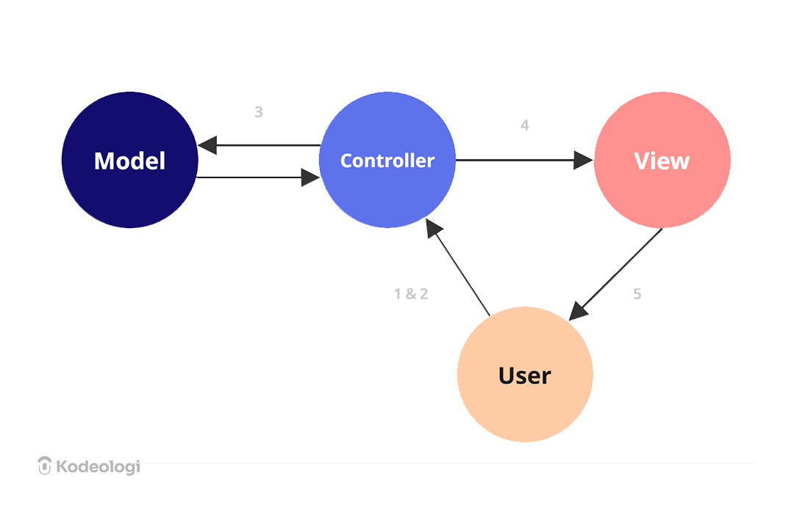

## Controller adalah tempat untuk menaruh logika/proses yang dijalankan setelah Route menerima request. Kalau Route bertugas menentukan "request ini harus ke mana?", maka Controller bertugas menentukan "apa yang harus dilakukan ya?".

```
GET /courses
       ↓
CourseController@index
       ↓
courses/index.blade.php

-----------------------------------

GET /courses/1
       ↓
CourseController@show
       ↓
courses/show.blade.php

// index() untuk Menampilkan daftar mata kuliah
// show() untuk Menampilkan detail satu mata kuliah
```

# View
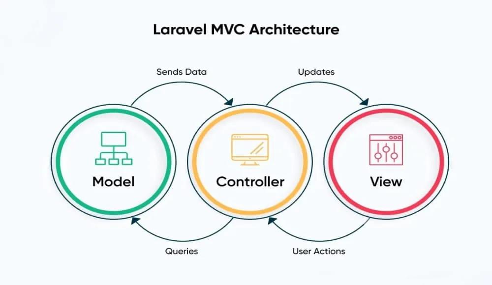

## View itu menentukan apa yang ditampilkan kepada pengguna. Di Laravel, View biasanya dibuat menggunakan Blade. Blade adalah template engine bawaan Laravel yang digunakan untuk membuat halaman HTML dengan lebih mudah.
Controller bertugas menyiapkan data, kemudian View menggunakan data tersebut untuk membuat tampilan. 


```html
<!-- Controller memberikan data:
Nama: Pemrograman Web
SKS: 3 
Lalu nanti view menampilkannya jadi bentuk HTML.-->


<h1>Pemrograman Web</h1>
<p>SKS: 3</p>
```

# Kesimpulan Materi
Route menentukan URL dan proses yang akan dijalankan, Controller mengatur logika serta data, sedangkan View/Blade mengatur tampilan data kepada pengguna.

---
# READ


## 1. Baris mana di `routes/web.php` yang menangkapnya?

### Route-nya adalah ini:

```php
Route::get('/tentang', function () {
    return view('tentang');
});

```

Route yang menangkap `/tentang` terdapat di `routes/web.php`, yaitu `Route::get('/tentang', function () { ... })`. Route tersebut menerima request GET pada URL `/tentang` dan menjalankan fungsi di dalamnya.

<br>

## 2. Kalau ditangani controller, berkas dan method mana?

### Pada kondisi saat ini, tidak ditangani Controller. Route `/tentang` langsung menggunakan Closure ini:

```php
function () {
    return view('tentang');
}
```

<br>

## 3. View mana yang dikembalikan? Di path apa persisnya?

### Di route terdapat di bawah ini, yang artinya laravel mencari View bernama `tentang`.
```php
return view('tentang');
```

Maka View yang dikembalikan adalah `tentang.blade.php`, yang berada di `resources/views/tentang.blade.php`.

<br>

## 4. Layout apa yang membungkusnya?


<br>

```html
<!DOCTYPE html>
<html>
<head>
...
</head>
<body>
...
</body>
</html>

```

Halaman `/tentang` saat ini tidak menggunakan layout. File `tentang.blade.php` berisi struktur HTML secara langsung dari `<!DOCTYPE html>` sampai `</html>`.

<br>

## 5. Jalankan `php artisan route:list --path=tentang`. Cocok dengan analisis Anda?

### hasilnya:
```
PS C:\Users\USER\Herd\kampuslms-kelompok-05> php artisan route:list --path=tentang

  GET|HEAD       tentang ............................................................................................................................................. routes/web.php:9

                                                                                                                                                                     Showing [1] routes

PS C:\Users\USER\Herd\kampuslms-kelompok-05> 
```
# Kesimpulan READ

Route `/tentang` terdapat pada `routes/web.php` dan menggunakan method GET. Route tersebut tidak menggunakan Controller, tetapi langsung menggunakan Closure untuk mengembalikan View `tentang`. View berada di `resources/views/tentang.blade.php` dan saat ini tidak menggunakan layout. Hasil `php artisan route:list --path=tentang` menunjukkan `GET|HEAD tentang` pada `routes/web.php:9`, sehingga hasilnya sesuai dengan analisis.


# BREAK

| # | Yang Dirusak | Prediksi Anda sebelum mencoba | Pesan Error Sebenarnya |
|---|--------------|-------------------------------|------------------------|
| 1 | Ubah `Route::get` menjadi `Route::post` pada route daftar mata kuliah | Akan terjadi `error 405` karena browser menggunakan `GET`, sementara `route` hanya menerima `POST`.| 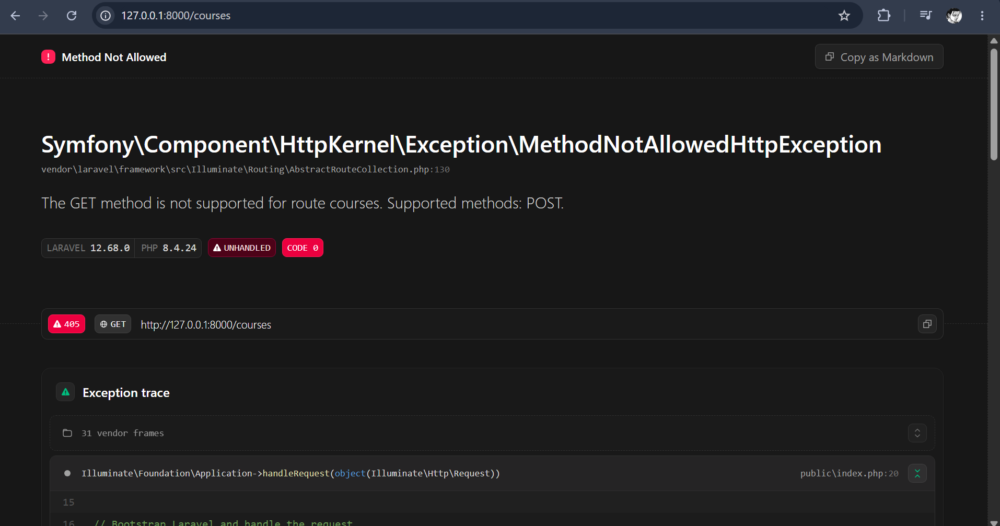 Metode `GET` tidak didukung untuk `route courses`. Metode yang didukung seharunya `POST`.
| 2 | Ubah nama view di `return view(...)`  menjadi yang tidak ada | Laravel akan menampilkan exception karena view yang dipanggil tidak ditemukan. | 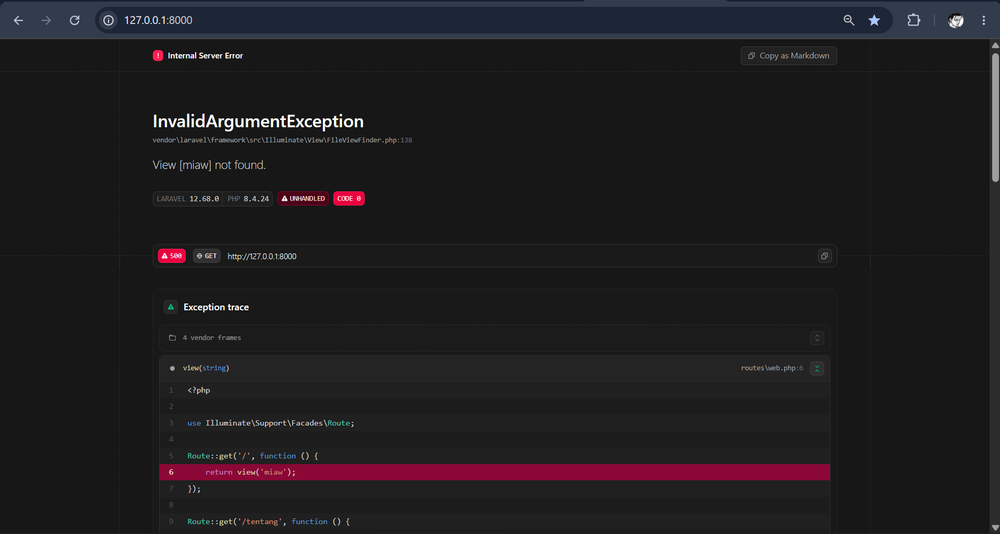 `View [miaw] not found.`|
| 3 | Hapus `->name('courses.show')`, lalu muat halaman yang memakai `route('courses.show')` |Laravel akan mengalami error karena halaman `/courses` masih menggunakan `route('courses.show')`, sedangkan nama route tersebut sudah dihapus. | 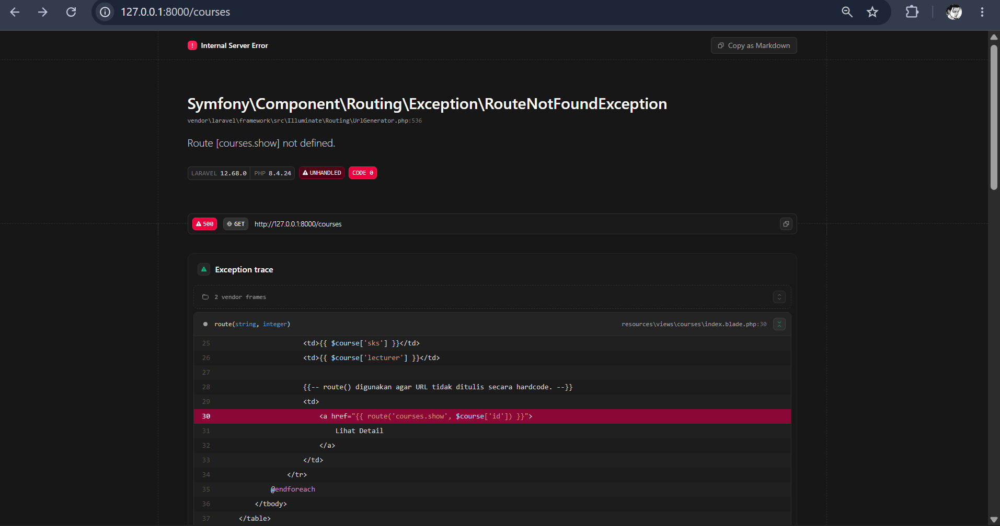 `Route [courses.show] not defined.` |
| 4 | Pindahkan `/courses/{course}`ke ATAS `/courses/create,` lalu buka `/courses/create` |Laravel akan menganggap `create` sebagai nilai parameter `{course}` karena `/courses/{course}` berada sebelum `/courses/create`. Akibatnya request masuk ke method `show`, bukan `create`, sehingga kemungkinan menghasilkan 404 karena `course create` tidak ditemukan. |  <br> 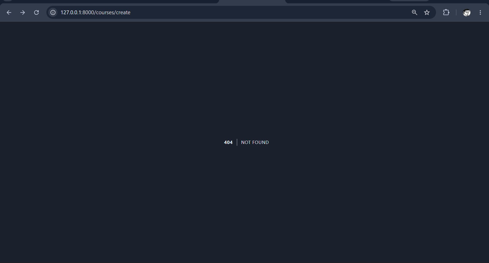 `404 Not Found` karena `/courses/create` terbaca sebagai `/courses/{course}` dengan nilai `{course}` = `create`, lalu `CourseController@show` tidak menemukan course tersebut. | 
| 5 | Ganti `{{ $nama }}` menjadi `{!! $nama !!}`, isi `$nama` dengan `<script>alert('XSS')</script>` | JavaScript pada `$nama` akan dijalankan karena `{!! !!}` tidak melakukan escape. | 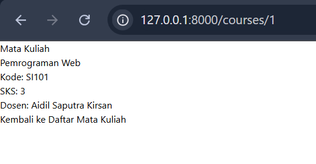 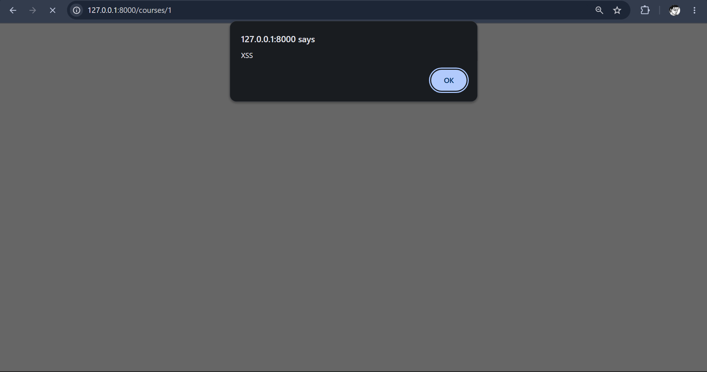 Tidak ada error. Muncul popup `XSS` di browser karena JavaScript dari `$nama` berhasil dieksekusi. |
| 6 | Hapus `@vite(...)` dari layout | Halaman akan kehilangan aset CSS dan JavaScript yang dimuat melalui Vite, sehingga tampilan atau fungsi JavaScript dapat berubah/tidak berjalan. | 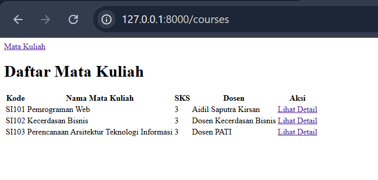 Tidak muncul error. Tampilan halaman tetap dapat dibuka, tetapi aset CSS dan JavaScript dari `@vite(...)` tidak dimuat. Pada halaman saat ini, perubahan visual tidak terlalu terlihat karena belum banyak menggunakan styling.
| 7 | Hentikan `npm run dev` lalu muat ulang halaman |Aset Vite tidak dapat dimuat karena development server dihentikan. | 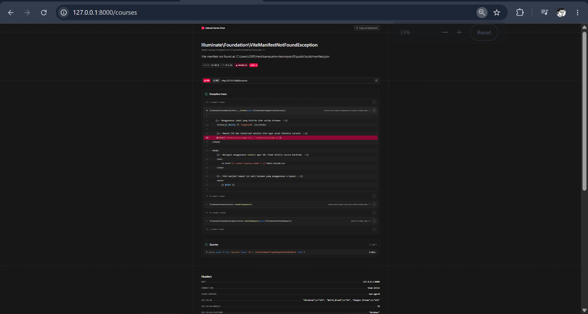 `Illuminate\Foundation\ViteManifestNotFoundException` dan `Vite manifest not found` karena Vite development server dihentikan dan file `public/build/manifest.json` belum tersedia.  |
| 8 | Panggil `route('courses.show')` tanpa mengirim parameter | Route membutuhkan parameter `{course}`, sehingga akan terjadi error jika parameter tidak diberikan. | 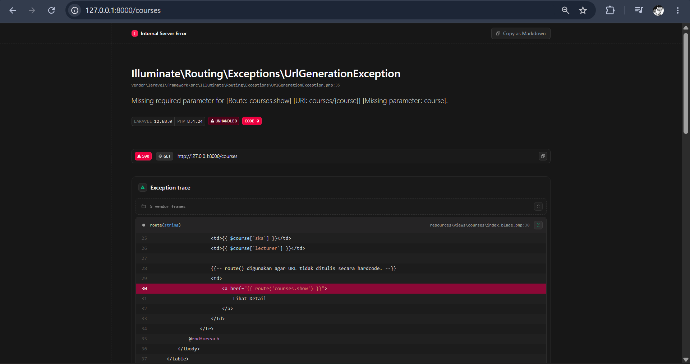`Missing required parameter` karena route `courses.show` membutuhkan parameter `{course}`. |
---

## FIX: Perbaikan Proyek Cacat (Branch `w01`)

repo `kampuslms-broken` tidak ada


## BUILD

1. Menghubungkan repositori kelompok `https://github.com/muhammadzaldysyahfiraz/kampuslms-kelompok-05` dan menerapkan *Branch Protection Rule* pada branch `main` (wajib *Pull Request* dan minimal 1 *Approving Review*).
2. Menjalankan Laravel 12 pada PHP 8.3/8.4 dengan basis data MySQL `kampus_db` di Laragon, serta memastikan template `.env.example` terdokumentasi tanpa mengekspos berkas rahasia `.env`.
3. Menulis dokumentasi resmi proyek KampusLMS Kelompok 05 yang memuat deskripsi sistem, tabel 5 anggota (NIM, peran, akun GitHub), prasyarat sistem, dan langkah instalasi lokal.
4. Mendaftarkan rute baru `Route::get('/tentang', ...)` pada berkas `routes/web.php` dan merancang tampilan web modern pada `resources/views/tentang.blade.php` untuk menampilkan identitas tim dan mata kuliah.
5. Mengerjakan perubahan pada branch kerja `dev-rifa`, melakukan push ke remote, membuka Pull Request (#1), mendapatkan *approval review*, dan berhasil melakukan *merge* ke branch `main`.

---

---

