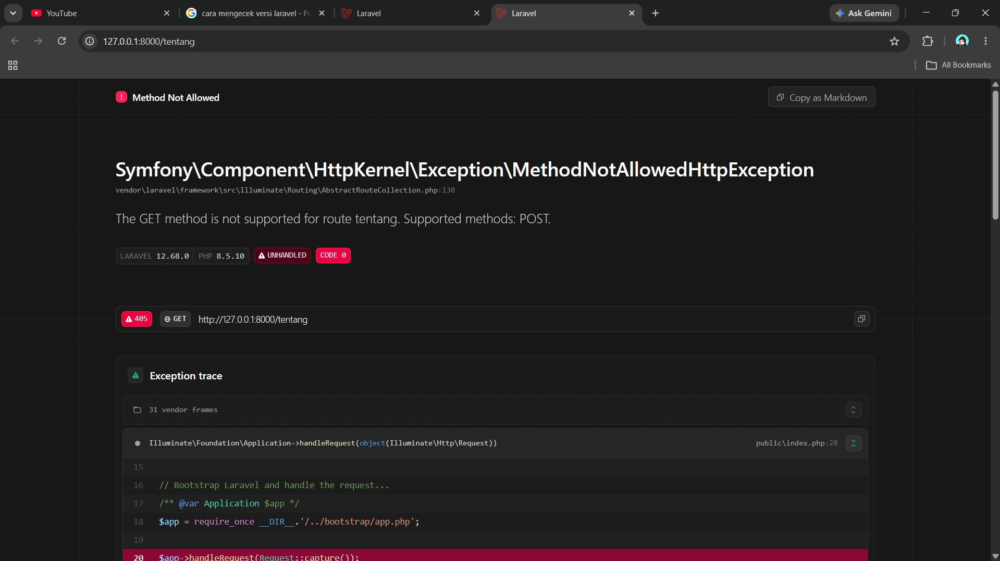
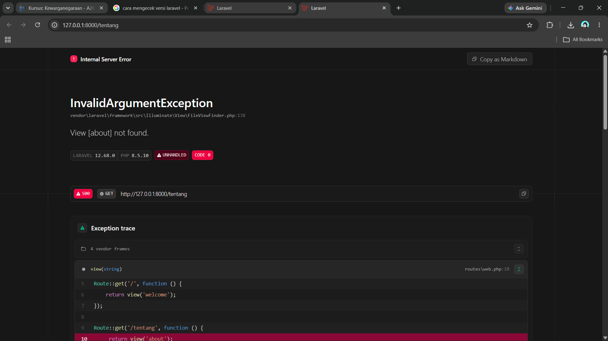
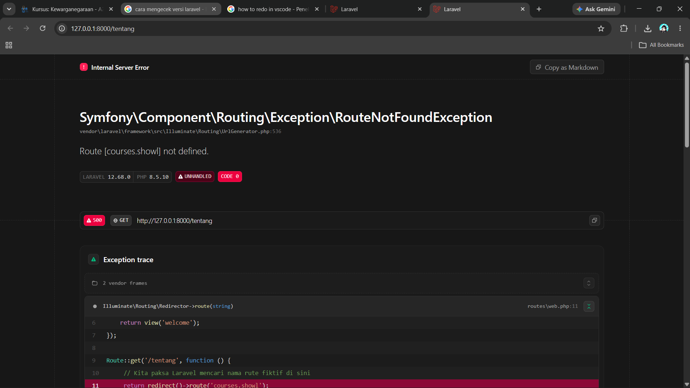

## Minggu 2 - Read → Break → Fix → Build<br>
---
**Nama: Muhammad Zaldy Syah Firaz**  
**NIM: 10241054**<br>

---  
### READ: Telusuri satu request penuh<br>
Ambil route /tentang yang Anda buat minggu lalu. Tanpa AI, tulis di catatan Anda:  
1. Baris mana di `routes/web.php` yang menangkapnya?:  
   Jawab:  
   Permintaan URL `/tentang` ditangkap secara oleh sistem routing Laravel pada berkas `routes/web.php` menggunakan metode penulisan `shortcut view closure`, kode tersebut terdapat pada baris 9, yaitu:
   ```php
   <?php
   use Illuminate\Support\Facades\Route;
   Route::get('/', function () {
    return view('welcome');
    });
   Route::get('/tentang', function () {
    return view('tentang');
   });

   ```
   Spesifiknya:  
   ```php
   Route::view('/tentang', 'tentang');
   ```

   Karena rute ini dideklarasikan menggunakan `Route::view`, framework Laravel 12 akan langsung memetakan URL tersebut untuk merender file presentasi tanpa melakukan pemrosesan logika atau pengalihan data terlebih dahulu di lapisan Controller.<br>


2. Kalau ditangani controller, berkas dan method mana?  
   Jawab:  
   Rute ini tidak ditangani oleh controller mana pun, karena di dalam folder tersebut hanya terdapat satu file bawaan basis framework, yaitu `Controller.php`.  Pada route tersebut tidak langsung menunjuk ke controller seperti `[XXXxxx::class, 'method']`, tetapi langsung menjalankan fungsi `function ()`.

3. View mana yang dikembalikan? Di path apa persisnya?  
   Jawab:  
   Komponen `view` dikembalikan oleh rute `/tentang`, berada di `resources/views/tentang.blade.php`.  Ditunjukkan oleh `return view('tentang')` pada `routes/web.php.`

4. Layout apa yang membungkusnya?  
   Jawab:  
   Di dalam direktori `resources/views/`, hanya terdapat dua file yaitu `tentang.blade.php` dan `welcome.blade.php`. Tidak ada folder `layouts/` maupun file induk seperti `app.blade.php`. Berkas `tentang.blade.php` tidak dibungkus oleh layout atau induk template manapun. File ini memuat tag `HTML` standar secara mandiri, utuh, dan langsung dari dalam berkasnya sendiri tanpa menggunakan mekanisme petunjuk `@extends` atau `@section` dari engine Blade.  

5. Jalankan php artisan route:list --path=tentang. Cocok dengan analisis Anda?  
   Jawab:  
   Ketika perintah `php artisan route:list --path=tentang` dijalankan di dalam terminal Cmder, sistem memfilter daftar rute dan menampilkan satu baris informasi spesifik untuk rute kustom kelompok.

   ```php
   D:\laragon\www\kampus(main -> origin)
   λ php artisan route:list --path=tentang

   GET|HEAD       tentang ....................................................................................................................................................................... routes/web.php:9
                                                                                                                                                                                    Showing [1] routes
   ```
   Kesimpulan:  
   Hasil keluaran terminal sesuai dengan analisis pada poin-poin sebelumnya. Terminal menunjukkan bahwa rute tersebut menggunakan metode `GET|HEAD`, dengan URL `/tentang`, dan kolom `Action` yang langsung merender view berupa file presentasi `tentang`, bukan dialihkan melalui Controller. Hal ini membuktikan bahwa routing pada Laravel 12 langsung memetakan dan membaca berkas `routes/web.php` sesuai dengan analisis struktur yang telah dicantumkan.  

---  
### BREAK - Delapan kerusakan  

|No| Yang Dirusak | Yang di pelajari | Prediksi Sebelumnya | Hasil Setelah Prediksi | 
|---|---|---|---|---|
|1. | Ubah `Route::get` menjadi `Route::post` pada route daftar mata kuliah | Method HTTP tidak cocok → 405 | Browser tidak akan bisa mengakses halaman via URL biasa karena URL browser secara bawaan mengirimkan method `GET`, sementara rute hanya menerima `POST`. |Terjadi bentrokan protokol HTTP (*method mismatch*). Framework Laravel menangkap ketidakcocokan ini dan langsung melempar *MethodNotAllowedHttpException*.  |  
|2. | Ubah nama view di return view(...) menjadi yang tidak ada | Exception view not found | Laravel gagal merender halaman karena file template Blade  tidak dapat ditemukan di dalam direktori proyek. | Ketika *Deploy now* di klik pada halaman utama untuk mengakses rute `/tentang`, engine pencari view Laravel langsung menelusuri direktori `resources/views/`. Karena `about.blade.php` tidak ditemukan di dalam sistem, Laravel mengembalikan *InvalidArgumentException* untuk menghentikan proses rendering halaman.  |  
|3. | Hapus ->name('courses.show'), lalu muat halaman yang memakai route('courses.show') | Kenapa nama route wajib | Eror saat memuat halaman karena fungsi pembantu `route()` kehilangan referensi nama/rute yang dicari di sistem memori framework.| `Symfony\Component\Routing\Exception\RouteNotFoundException: Route [courses.show] not defined.` Ketika fungsi *helper* `route('courses.show')` dipanggil, Laravel mencari nama tersebut di dalam registry rute internal framework. Karena referensi nama tidak ditemukan, Laravel menghentikan proses eksekusi di baris berkas `routes/web.php` tersebut dan melempar *RouteNotFoundException*. |  
|4. | Pindahkan `/courses/{course} ke ATAS /courses/create`, lalu buka `/courses/create` | Urutan route menentukan | Halaman rute statis (`/create`) tidak akan bisa diakses karena Laravel akan menganggap string tersebut sebagai isi dari variabel parameter dinamis.| 


