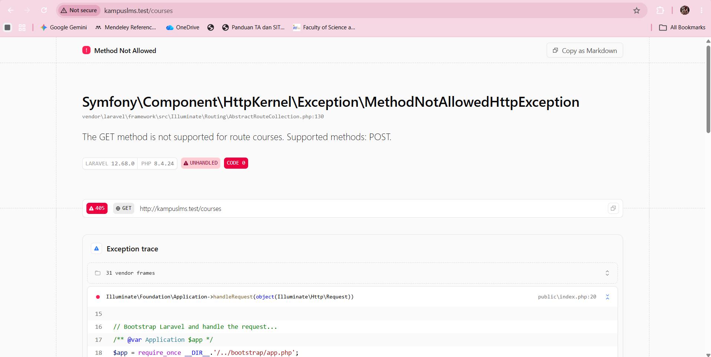
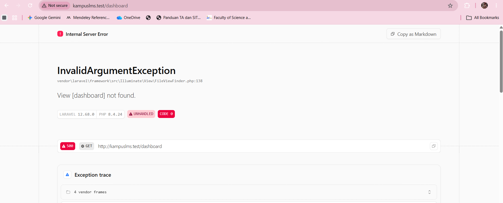
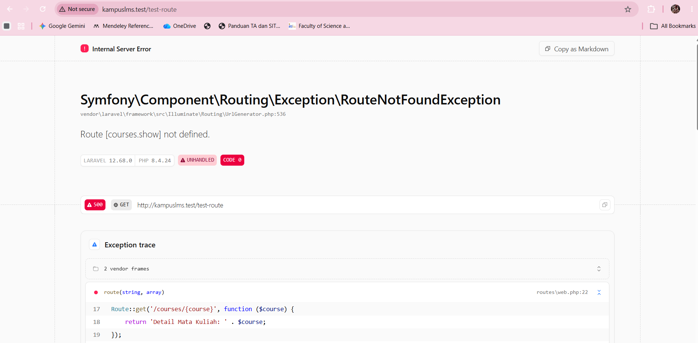
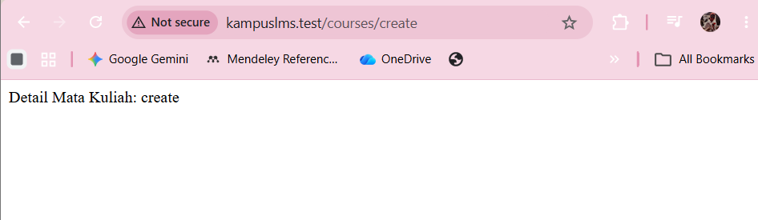
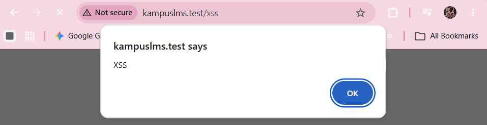
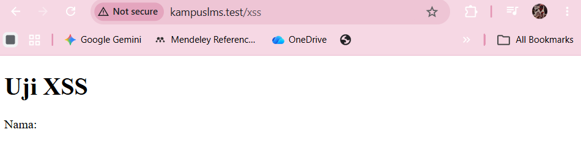
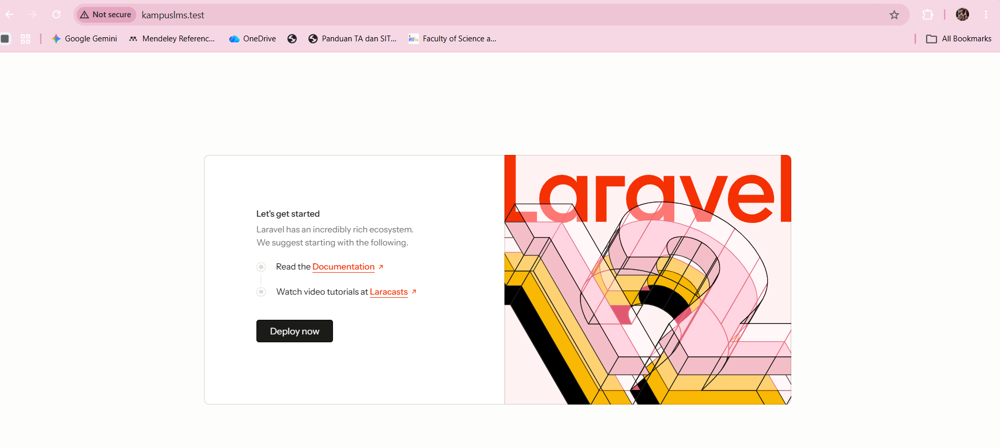
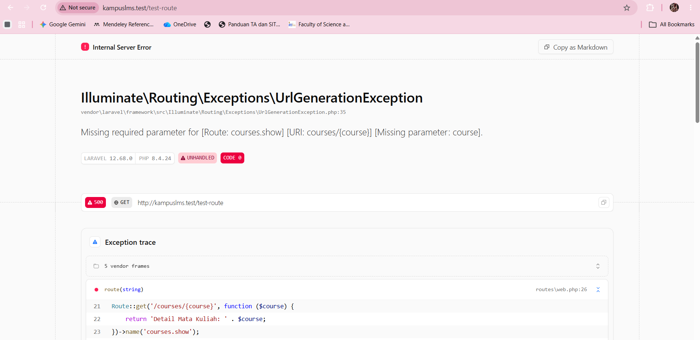

# Catatan Praktikum Minggu 2

**Mata Kuliah:** Pemrograman Web

**Nama:** Nova Reskianti

**NIM:** 10241058

---

## READ:  Telusuri satu request penuh

**Ambil route /tentang yang Anda buat minggu lalu. Tanpa AI, tulis di catatan Anda:**

### 1. Baris mana di `routes/web.php` yang menangkapnya?

Baris yang menangkap route /tentang adalah baris ke 9 :
```php
<?php

use Illuminate\Support\Facades\Route;

Route::get('/', function () {
    return view('welcome');
});

Route::get('/tentang', function () {
    return view('tentang');
});
```
---
### 2. Kalau ditangani controller, berkas dan method mana?

Tidak ada controller, karena route `/tentang` masih menggunakan closure dan langsung mengembalikan view tentang. Route tersebut tidak menunjuk ke controller seperti `[NamaController::class, 'method']`, tetapi langsung menjalankan fungsi `function ()`.

---
### 3. View mana yang dikembalikan? Di path apa persisnya?

View yang dikembalikan adalah `tentang`, yang ditunjukkan oleh `return view('tentang') pada routes/web.php.`
```php
Route::get('/tentang', function () {
    return view('tentang');
```
File view tersebut berada di `resources/views/tentang.blade.php`

---
### 4. Layout apa yang membungkusnya?

Halaman `/tentang` saat ini belum menggunakan layout atau komponen Blade. Hal ini dapat dilihat dari isi `resources/views/tentang.blade.php` yang langsung berisi struktur lengkap HTML seperti `<!DOCTYPE html>`, `<head>`, `<body>`, CSS, dan seluruh konten halaman. Selain itu, tidak terdapat penggunaan `<x-layout>` maupun `@extends` yang menunjukkan bahwa halaman tersebut menggunakan layout. Oleh karena itu, seluruh struktur halaman saat ini ditulis langsung di file `tentang.blade.php.`

---
### 5. Jalankan php artisan route:list --path=tentang. Cocok dengan analisis Anda?

Berdasarkan kode pada `routes/web.php`, saya memperkirakan route `/tentang` menggunakan method `GET` dan didefinisikan pada baris 9. Karena menggunakan `Route::get()`, pada `route:list` kemungkinan akan ditampilkan sebagai `GET|HEAD`.

Hasil `php artisan route:list --path=tentang` :
```php
PS D:\Nova R\Kuliah\Semeter 5\Proweb\Laravel\kampuslms> herd php artisan route:list --path=tentang

  GET|HEAD       tentang ............................................................................................................................ routes/web.php:9

                                                                                                                                                    Showing [1] routes
```
Kesimpulan : 

Analisa saya cocok dengan hasil `php artisan route:list --path=tentang`. Route `/tentang` menggunakan `GET|HEAD` dan berada di `routes/web.php` pada baris 9.

---
## BREAK:  Delapan kerusakan 

| # | Yang dirusak | Yang Anda pelajari | Prediksi | Hasil Pengujian |
|----|---------|------------|---------|------------|
| 1 | Ubah `Route::get` menjadi `Route::post` pada route daftar mata kuliah | Method HTTP tidak cocok → 405 | Halaman tidak akan bisa dibuka karena browser mengirim `GET`, namun route meminta `POST`. | Muncul error **405 Method Not Allowed** dengan pesan: *"The GET method is not supported for route courses. Supported methods: POST."*  |
| 2 | Ubah nama view di `return view(...)` menjadi yang tidak ada | Exception view not found | Akan terjadi error karena file view yang dipanggil tidak ditemukan.| Muncul error `View [dashboard] not found`. karena file `dashboard.blade.php` tidak ditemukan.|
| 3 | Hapus `->name('courses.show')`, lalu muat halaman yang memakai `route('courses.show')` | Kenapa nama route wajib |Akan terjadi error karena route bernama courses.show sudah tidak terdaftar. |Muncul `Route [courses.show] not defined`. `(RouteNotFoundException)`. |
| 4 | Pindahkan `/courses/{course}` ke ATAS `/courses/create`, lalu buka `/courses/create` | Urutan route menentukan |`create` dianggap sebagai nilai `{course}` | Muncul `Detail Mata Kuliah: create`, sehingga terbukti urutan route menentukan pencocokan route. |
| 5 | Ganti `{{ $nama }}` menjadi `{!! $nama !!}`, isi `$nama` dengan `<script>alert('XSS')</script>` | **XSS nyata di layar Anda sendiri** |JavaScript akan dieksekusi karena output tidak di-escape. |Muncul popup `XSS` pada browser. |
| 6 | Hapus `@vite(...)` dari layout | Aset tidak termuat |Aset CSS/JS dari `Vite` tidak akan dimuat sehingga tampilan halaman dapat berubah atau menjadi tidak ter-styling. | |
| 7 | Hentikan `npm run dev` lalu muat ulang halaman | Beda dev server vs build | Development server Vite seharusnya berhenti sehingga aset yang bergantung pada Vite tidak dapat dimuat/diperbarui.| npm run dev tidak dapat dijalankan karena Vite tidak dikenali ('vite' is not recognized).|
| 8 | Panggil `route('courses.show')` tanpa mengirim parameter | Missing required parameter |Akan terjadi error karena `route courses.show` membutuhkan parameter `{course}`. |Muncul `Missing required parameter` ... `[Missing parameter: course]` dengan `UrlGenerationException`.  |