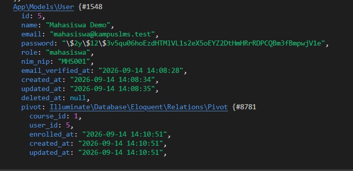
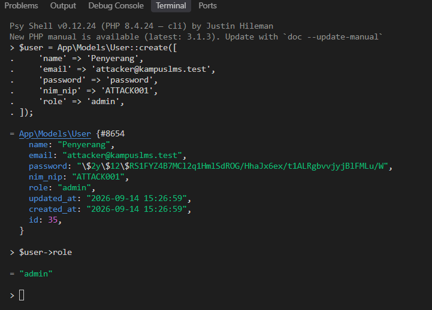
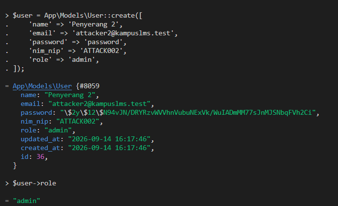
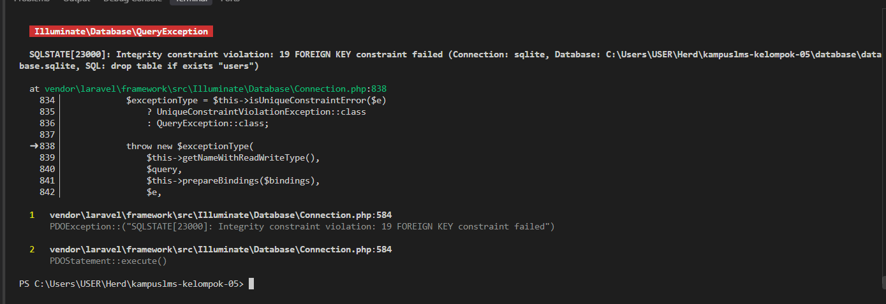

# Catatan Minggu 3 Pemrograman Web
---
---

Nama: Muhammad Yuspa Ardiansyah

NIM: 10241052
 
 
 
---
# READ

## 1. Untuk setiap foreign key, tentukan perilaku `onDelete-nya` dan tuliskan alasannya.

`courses.lecturer_id → restrictOnDelete()`

Artinya, dosen tidak boleh dihapus jika masih memiliki mata kuliah. Hal ini untuk mencegah mata kuliah kehilangan dosen yang mengajarnya.

`course_user.course_id → cascadeOnDelete()`

Jika mata kuliah dihapus, data pendaftaran mahasiswa pada mata kuliah tersebut ikut dihapus karena sudah tidak diperlukan.

`course_user.user_id → cascadeOnDelete()`

Jika mahasiswa dihapus, data pendaftarannya pada mata kuliah ikut dihapus.

`materials.course_id → cascadeOnDelete()`

Jika mata kuliah dihapus, semua materi yang dimiliki mata kuliah tersebut ikut dihapus.

`materials.uploaded_by → restrictOnDelete()`

Pengguna yang mengunggah materi tidak boleh dihapus jika masih memiliki materi, agar data materi tidak kehilangan pemilik/pengunggah.

`assignments.course_id → cascadeOnDelete()`

Jika mata kuliah dihapus, tugas-tugasnya ikut dihapus karena tugas tersebut hanya digunakan untuk mata kuliah itu.

`assignments.created_by → restrictOnDelete()`

Dosen yang membuat tugas tidak boleh dihapus jika masih memiliki tugas, agar data tugas tetap memiliki pembuat.

`submissions.assignment_id → cascadeOnDelete()`

Jika tugas dihapus, submission untuk tugas tersebut ikut dihapus karena submission tersebut tidak lagi memiliki tugas.

`submissions.user_id → restrictOnDelete()`

Mahasiswa tidak boleh dihapus jika masih memiliki submission, agar riwayat pengumpulan tugas tetap terjaga.

`grades.submission_id → cascadeOnDelete()`

Jika submission dihapus, nilai yang terkait dengan submission tersebut ikut dihapus.

`grades.graded_by → restrictOnDelete()`

Dosen yang memberikan nilai tidak boleh dihapus jika masih memiliki riwayat penilaian. Kraung lebih mudahnya itu `cascade` digunakan ketika data anak memang tidak berguna lagi jika data induknya dihapus, sedangkan `restrict` digunakan untuk melindungi data penting agar tidak kehilangan hubungan/riwayat.

 

## 2. Kalau seorang dosen dihapus, apa yang terjadi pada mata kuliahnya? Kenapa dirancang begitu?

Jika seorang dosen dihapus, mata kuliah yang masih diampunya tidak ikut terhapus. Penghapusan dosen akan ditolak oleh database karena `courses.lecturer_id` menggunakan `restrictOnDelete().`

Hal ini dirancang agar mata kuliah tidak kehilangan dosen yang mengajarnya dan data mata kuliah tetap terjaga. Jadi, dosen harus tidak lagi menjadi pengampu mata kuliah terlebih dahulu sebelum dapat dihapus.

Intinya adalah `restrictOnDelete()` = dosen tidak bisa dihapus selama masih mengampu mata kuliah.

 

## 3. Kenapa grades.submission_id bersifat unique, bukan sekadar index biasa?

Karena satu submission hanya boleh memiliki satu nilai.

Jika hanya menggunakan `index`, database masih mengizinkan satu submission memiliki lebih dari satu grade. Dengan `unique`, database akan mencegah nilai ganda untuk submission yang sama.

Contoh:

Submission ID 10 → Nilai 85 ✅
Submission ID 10 → Nilai 90 ❌

Hal ini sesuai dengan relasi one-to-one (1 submission = 1 nilai).

Jadinya itu `index` hanya membantu pencarian data agar lebih cepat, sedangkan `unique` juga mencegah data yang sama masuk lebih dari sekali.

# Kesimpulan READ

Route `/tentang` terdapat pada `routes/web.php` dan menggunakan method GET. Route tersebut tidak menggunakan Controller, tetapi langsung menggunakan Closure untuk mengembalikan View `tentang`. View berada di `resources/views/tentang.blade.php` dan saat ini tidak menggunakan layout. Hasil `php artisan route:list --path=tentang` menunjukkan `GET|HEAD tentang` pada `routes/web.php:9`, sehingga hasilnya sesuai dengan analisis.

# BREAK

| # | Yang Dirusak | Prediksi Anda sebelum mencoba | Pesan Error Sebenarnya |
|---|--------------|-------------------------------|------------------------|
| 1 | Hapus `unique(['course_id','user_id'])` dari course_user, lalu daftarkan mahasiswa yang sama dua kali. | Mahasiswa yang sama dapat terdaftar dua kali karena database tidak lagi memiliki aturan untuk mencegah kombinasi `course_id` dan `user_id` yang sama |  Ditemukan kerusakan berupa data duplikat yaitu mahasiswa yang sama dapat memiliki dua baris pendaftaran pada mata kuliah yang sama. Hal ini menunjukkan bahwa `unique` diperlukan untuk menjaga agar satu mahasiswa hanya terdaftar satu kali pada satu mata kuliah
| 2 | Tambahkan `role` ke `$fillable` model `User`, lalu kirim request pembuatan user dengan `role=admin` lewat form yang tidak punya field role| Diperkirakan sistem akan tetap membatasi pengisian `role` karena `role` merupakan data sensitif yang seharusnya tidak dapat diubah langsung oleh pengguna. |   Tidak terjadi error. User berhasil dibuat dengan `role = admin`. Hal ini membuktikan bahwa ketika `role` dimasukkan ke `$fillable`, field tersebut dapat diisi melalui mass assignment. Kondisi ini berbahaya karena pengguna dapat menyisipkan `role=admin` dan memperoleh hak akses admin. |
| 3 | Ganti seluruh `$fillable` dengan `protected $guarded = [];` lalu ulangi nomor 2 | Saya memperkirakan field `role` yang seharusnya tidak boleh diisi langsung oleh pengguna akan ikut diterima karena semua atribut model dibuka untuk mass assignment. |  Tidak ada pesan error. User berhasil dibuat dan ketika menjalankan `$user->role`, hasilnya adalah `"admin"`. Hal ini membuktikan bahwa penggunaan `protected $guarded = [];` dapat membuat field sensitif seperti `role` ikut diisi melalui mass assignment.|
| 4 | Kosongkan isi `down()` di satu migrasi, lalu jalankan `php artisan migrate:refresh` | Saya memperkirakan `php artisan migrate:refresh` akan gagal karena migration `create_courses_table` tidak dapat melakukan rollback dengan benar. |  Perintah `php artisan migrate:refresh` gagal saat proses rollback dengan pesan `FOREIGN KEY constraint failed` ketika Laravel mencoba menghapus tabel `users`. Hal ini menunjukkan bahwa struktur foreign key antar tabel membuat proses rollback tidak dapat diselesaikan dengan benar ketika migration tidak dibalik secara lengkap. |
| 5 | Ubah `restrictOnDelete` pada `lecturer_id` menjadi `cascadeOnDelete`, lalu hapus satu dosen | - | - |

---

## FIX: Perbaikan Proyek Cacat (Branch `w01`)

repo `kampuslms-broken` tidak ada

## BUILD

1. Seluruh migrasi sesuai Bagian 4 spesifikasi, termasuk semua constraint dan index. Reversible.
2. Seluruh model dengan relasi lengkap sesuai Bagian 4.3, $fillable yang ketat, casts() sebagai method.
3. Factory + seeder yang memenuhi Bagian 4.4, termasuk 3 akun demo.
4. CRUD Mata Kuliah berfungsi penuh (index, create, store, show, edit, update, destroy).
5. CRUD Pengguna berfungsi penuh, dengan role tidak di $fillable melainkan diisi eksplisit di controller.
6. CI GitHub Actions aktif dan hijau: migrate:fresh --seed sukses, migrate:refresh sukses, .env tidak ter-commit.
7. Setiap anggota punya commit atas namanya sendiri, dan setiap fitur masuk lewat PR yang direview anggota lain.

---

---

